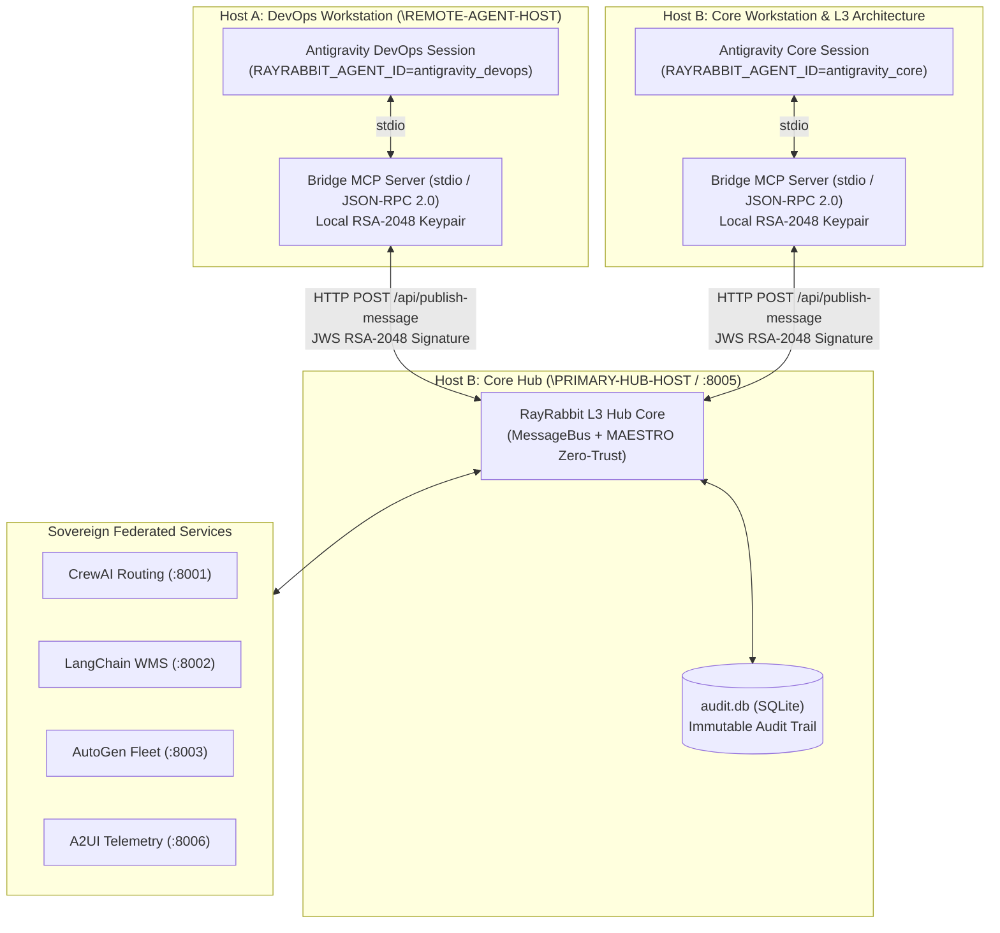
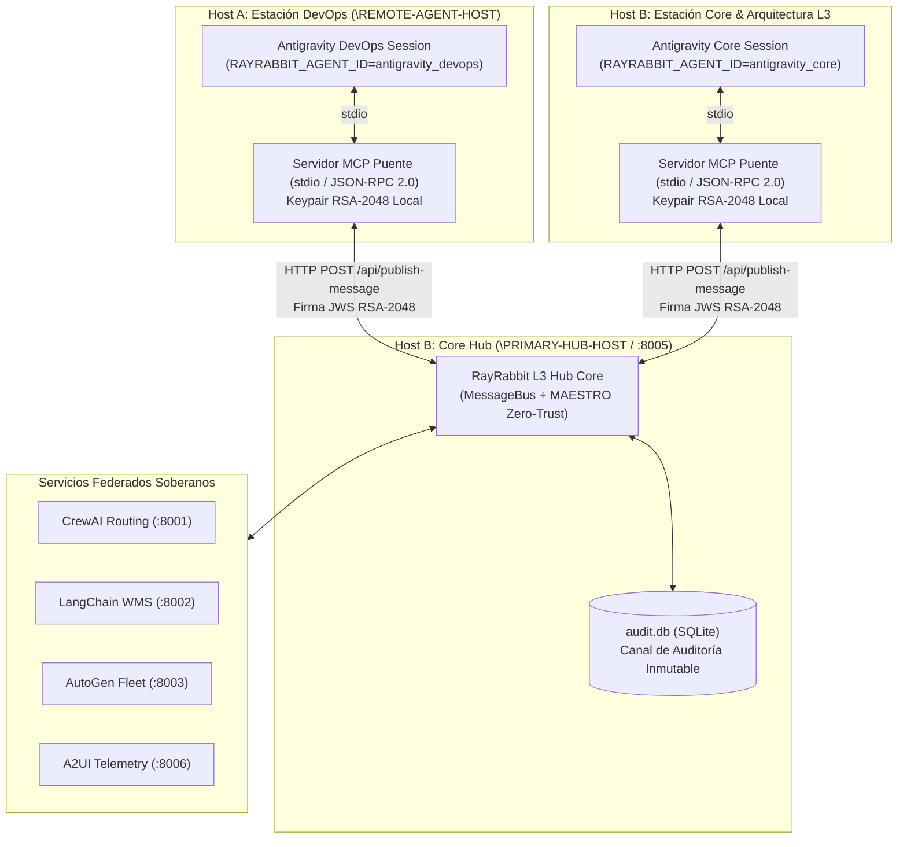

# L3 Architecture: RayRabbit Plugin & MCP Server for Google Antigravity

**Project:** RayRabbit — Next-Generation AI Interoperability and Agnostic Infrastructure (AI TCP/IP + TLS + HTTP).  
**Vision:** Neutral L3 layer standard to connect heterogeneous agents, sovereign SDKs (Python/JS), A2UI visual portals, and cognitive frameworks (CrewAI, AutoGen, LangChain) via horizontal mediation without central orchestrators or shared global state (**Shared-Nothing Architecture**).

---

## 1. Network Topology and Horizontal Mediation

The Antigravity plugin connects any session (IDE or CLI) to the RayRabbit sovereign network without hijacking internal agent reasoning loops:

---

## 2. Zero-Patch Principle (Core Immutability)

* **Zero Modifications in Core:** The RayRabbit core (`rayrabbit/core/`, `rayrabbit/security/`, `api/server.py`) requires zero patches or added dependencies to support Google Antigravity.
* **Autonomous Client:** All plugin code resides exclusively in `clients/antigravity/`, operating as an independent sovereign node over RayRabbit open protocols.

---

## 3. MAESTRO Zero-Trust Security (RFC 7515 JWS)

Each Antigravity session operates with an autonomous asymmetric cryptographic identity:
1. **Automated Key Generation:** When launching the MCP server, an RSA-2048 keypair is generated in `./keystore_mcp/` if not present.
2. **Per-Message Signatures:** Every payload sent via `rayrabbit_send_message` is digitally signed following the JWS Compact standard (`RS256` algorithm with `PSS` padding and `SHA-256` digest).
3. **Hub Verification:** The Hub verifies the signature against the public key attached in `X-RayRabbit-Bridge-Public-Key-PEM` header or stored in the KeyStore, enforcing authenticity and non-repudiation.

---

## 4. Exposed MCP Tool Catalog

| MCP Tool | Description | Key Parameters |
| :--- | :--- | :--- |
| `rayrabbit_send_message` | Sends a signed A2A message to another agent or remote session. | `recipient_id`, `content`, `message_type`, `correlation_id` |
| `rayrabbit_read_inbox` | Retrieves inbox messages and consensus notifications. | `correlation_id`, `limit` |
| `rayrabbit_list_agents` | Discovers active federated nodes and agents across the mesh. | *(None)* |
| `rayrabbit_call_tool` | Invokes domain tools on remote nodes (WMS, Routing, Fleet). | `tool_name`, `arguments` |
| `rayrabbit_get_telemetry` | Fetches live health metrics and telemetry from A2UI Dashboard. | `stream_id` |
| `rayrabbit_publish_fact` | Immutably persists facts into shared L3 Sovereign Memory. | `fact_key`, `fact_value` |

---

🇪🇸 Documentación Completa en Español (Haz clic para desplegar)

# Arquitectura L3: Plugin & Servidor MCP de RayRabbit para Google Antigravity

**Proyecto:** RayRabbit — Infraestructura de Interoperabilidad y Agnóstica de Próxima Generación de IA (AI TCP/IP + TLS + HTTP).  
**Visión:** Estándar neutral de capa L3 para conectar agentes heterogéneos, SDKs soberanos (Python/JS), portales visuales A2UI y frameworks cognitivos (CrewAI, AutoGen, LangChain) mediante mediación horizontal sin coordinadores centrales ni estado global compartido (**Shared-Nothing Architecture**).

---

## 1. Topología de Red y Mediación Horizontal

El plugin de Antigravity conecta cualquier sesión (IDE o CLI) a la red soberana de RayRabbit sin invadir la lógica interna de los agentes:

---

## 2. Principio Zero-Patch (Inmutabilidad del Core)

* **Cero Modificaciones en el Core:** El núcleo de RayRabbit (`rayrabbit/core/`, `rayrabbit/security/`, `api/server.py`) no requiere parches ni dependencias adicionales para dar soporte a Antigravity.
* **Cliente Autónomo:** Todo el código del plugin reside exclusivamente en `clients/antigravity/`, operando como un nodo soberano más conectado a través de los protocolos abiertos de RayRabbit.

---

## 3. Seguridad MAESTRO Zero-Trust (RFC 7515 JWS)

Cada sesión de Antigravity cuenta con una identidad criptográfica asimétrica autónoma:
1. **Generación Automática de Claves:** Al arrancar el servidor MCP, se genera un par de claves RSA-2048 en `./keystore_mcp/` si no existen previamente.
2. **Firma de Mensajes:** Cada payload enviado por `rayrabbit_send_message` se firma digitalmente según el estándar JWS Compact (algoritmo `RS256` con padding `PSS` y hash `SHA-256`).
3. **Validación en el Hub:** El Hub valida la firma contra la clave pública adjunta en la cabecera `X-RayRabbit-Bridge-Public-Key-PEM` o almacenada en el KeyStore, garantizando autenticidad y no repudio.

---

## 4. Catálogo de Herramientas MCP Expuestas

| Herramienta MCP | Descripción | Parámetros Clave |
| :--- | :--- | :--- |
| `rayrabbit_send_message` | Envía un mensaje A2A firmado a otro agente o sesión. | `recipient_id`, `content`, `message_type`, `correlation_id` |
| `rayrabbit_read_inbox` | Consulta el buzón de entrada y mensajes de consenso. | `correlation_id`, `limit` |
| `rayrabbit_list_agents` | Descubre nodos y agentes federados activos en la malla. | *(Sin parámetros)* |
| `rayrabbit_call_tool` | Invoca herramientas en nodos remotos (WMS, Routing, Flota). | `tool_name`, `arguments` |
| `rayrabbit_get_telemetry` | Obtiene métricas y telemetría en vivo del Dashboard A2UI. | `stream_id` |
| `rayrabbit_publish_fact` | Persiste hechos en la Memoria Soberana L3 compartida. | `fact_key`, `fact_value` |

