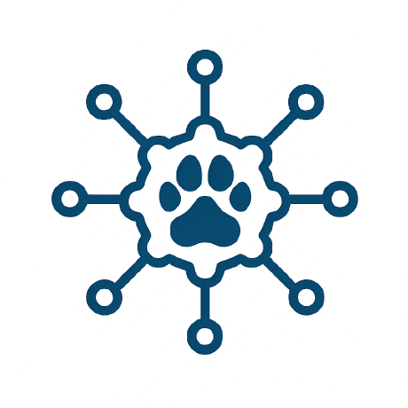
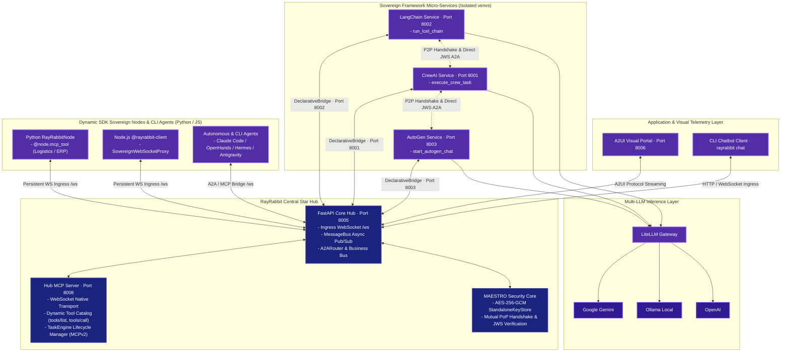
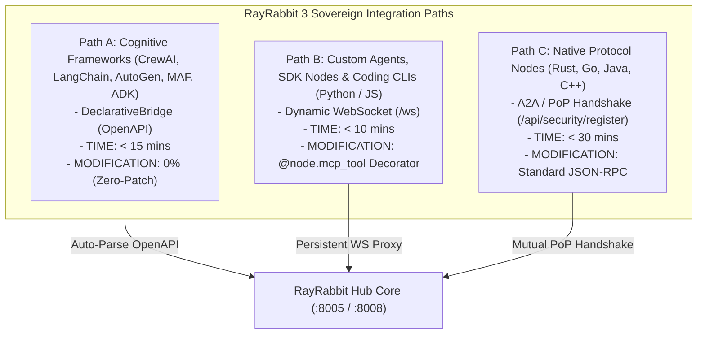
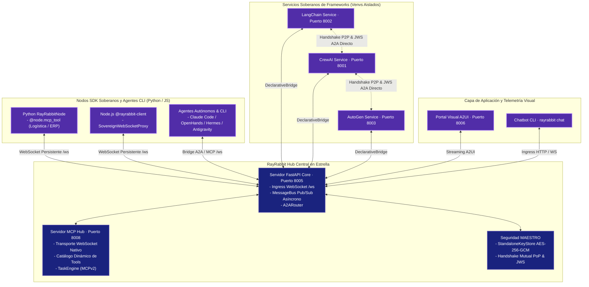

<div align="center">



<p align="center">
  <strong>Universal Interoperability Infrastructure for AI Agents</strong><br>
  <em>The Secure Foundation for the Agentic Internet (L3: TCP/IP + TLS + HTTP for Agentic AI).</em>
</p>

<p align="center">
  <a href="https://github.com/rayrabbit-ai/rayrabbit-oss/releases"></a>
  <a href="https://github.com/rayrabbit-ai/rayrabbit-oss/"></a>
  <a href="LICENSE"></a>
  <a href="clients/LICENSE"></a>
  <a href="https://a2a-protocol.org/"></a>
  <a href="https://modelcontextprotocol.io/"></a>
  <a href="https://github.com/a2ui-project/a2ui"></a>
  <a href="#verifiable-zero-trust-security--maestro-framework"></a>
  <a href="https://github.com/rayrabbit-ai/rayrabbit-oss/issues"></a>
  <a href="https://discord.gg/rayrabbit"></a>
</p>

<p align="center">
  <strong>A2A · A2UI · MCPv2 · MAESTRO · Zero-Trust · Enterprise-Ready</strong>
</p>

</div>

---

**RayRabbit** is not another agentic orchestrator. It is a **Universal Interoperability Infrastructure** designed to serve as the "TCP/IP + TLS" protocol layer for heterogeneous AI agents. By implementing the **A2A (Agent-to-Agent)** protocol from Google, the **MCP/MCPv2 (Model Context Protocol)** from Anthropic, and the **A2UI** visual telemetry protocol natively, RayRabbit unifies fragmented AI agent ecosystems into a secure, decentralized, and sovereign grid.

RayRabbit connects **heterogeneous agents, domain tools & SDKs (Python/JS), coding assistants (Claude Code, Codex, Antigravity, OpenHands, Hermes, OpenClaw), cognitive frameworks (CrewAI, AutoGen, LangChain, MAF, LlamaIndex, ADKs), and A2UI visual portals** in under 30 minutes without modifying their core logic.

---

> [!IMPORTANT]
> ### Status: Public Developer Preview (v0.1.0-alpha)
> RayRabbit is currently in **Public Developer Preview**. Distribution is provided directly via GitHub [Releases](https://github.com/rayrabbit-ai/rayrabbit-oss/releases) and source code bootstrap.
> 
> * **Interim Dual-Track Transport**: Standard HTTP endpoints coexist with native streaming channels (`/ws/a2ui`, `/ws`).
> * **Virtual Context & Infinite Memory (Active R&D)**: Engineering an OS-level Virtual Context Manager inspired by operating system virtual memory paging. RayRabbit enables LLMs to self-manage, page, and swap their own hierarchical memory tiers over native MCP tools, achieving boundless context continuity.
> * **Community Feedback**: We welcome architectural feedback, use case discussions, and security RFCs in [GitHub Community & Issues](https://github.com/rayrabbit-ai/rayrabbit-oss/issues) and [Discord](https://discord.gg/rayrabbit).

---

# Why RayRabbit?

> **You have brilliant agents. Isolated.**
> A CrewAI squad that reasons. A LangChain pipeline that processes data.
> An AutoGen cluster that debates. A monolithic autonomous agent like OpenHands, Hermes, or OpenClaw. A custom Python script querying your ERP. A dashboard no one sees.
>
> **And none of them can talk to each other securely.**
>
> That ends today.

---

## The Core Challenge

Every new agent you deploy to production costs **weeks of fragile glue code**:
ad-hoc translators, brittle bridge APIs, custom tunnels, and endless monkey-patching.
With every patch comes an attack vector, a single point of failure, and compounding technical debt.

The agentic AI ecosystem is fragmented into **communication silos**.
The question is not *if* your agents need to communicate.
It is **how much time and engineering effort you are losing while they remain disconnected**.

---

## RayRabbit is NOT Another Agentic Framework

**It is the neutral infrastructure layer that multiplies the value of your existing frameworks and agents.**

RayRabbit operates at **Layer 3 of Agentic Interoperability (L3)**:
the **TCP/IP + TLS + HTTP layer for Agentic AI**.

| What We DO NOT Do | What We ACTUALLY Do |
|---|---|
| **We do not control your reasoning** or LLM execution loops | **We transport intent, state, tasks, and data** securely between peers |
| **We do not touch your code** (Zero-Patch) | We connect your agents **exactly as they are built** |
| **We do not compete** with LangChain, CrewAI, AutoGen, MAF, ADK, OpenHands, Hermes, or OpenClaw | We **federate** them while preserving 100% framework autonomy |
| **Zero vendor lock-in**: disconnect RayRabbit, your agents stay alive | Built on **open industry standards** (Google A2A, Anthropic MCP, A2UI) |

---

## Core Capabilities & Integration Paths

Connect **any agent, framework, SDK, CLI, or language** into a sovereign, peer-to-peer federation without translation overhead:

| What You Have Today | Integration Path | Setup Time | Code Modification |
|---|---|---|---|
| **CrewAI · LangChain · AutoGen · MAF · ADK** | **Path A** — DeclarativeBridge (OpenAPI) | **< 15 min** | **0% (Zero-Patch)** |
| **Custom Python / TypeScript SDK Nodes** | **Path B** — Sovereign WebSocket (`/ws`) | **< 10 min** | 1 decorator (`@node.mcp_tool`) |
| **Native Nodes & Monoliths (Rust, Go, Java, C++, OpenHands, Hermes, OpenClaw)** | **Path C** — Native A2A + Mutual PoP Handshake | **< 30 min** | Standard JSON-RPC 2.0 |

```python
# Path B Example: Turn any script into a Sovereign Node in 4 lines
from rayrabbit_client import RayRabbitNode

node = RayRabbitNode(agent_id="erp_logistics_node", hub_url="ws://127.0.0.1:8005/ws")

@node.mcp_tool(category="logistics")
def get_shipment_status(order_id: str) -> dict:
    return {"order_id": order_id, "status": "IN_TRANSIT", "eta": "14:30"}

node.start()  # Instantly discoverable by CrewAI, LangChain, and A2UI
```

---

## Key Architectural Advantages

### Verifiable Zero-Trust Security — MAESTRO Framework
Security is not an external firewall: **it is a cryptographic property of the transport layer**.
- **Mutual Proof of Possession (Mutual PoP) Handshake** over `/api/security/register` before granting access to the bus.
- **JWS Signatures (RFC 7515 Compact) with RSA-4096 on EVERY message** for absolute non-repudiation.
- **Keys encrypted at rest with AES-256-GCM** via `StandaloneKeyStore` (PBKDF2HMAC, 600,000 iterations).
- **Immutable Blockchain-style Audit Trail (WORM)** in private SQLite databases with SHA-256 hash chaining.
- **Global revocation and isolation** of compromised agents in **< 5 ms**.

### Complete Sovereignty (Shared-Nothing Architecture)
Every agent owns its private keys, memory, and audit database.
**No shared global state. No Single Point of Failure (SPOF). No identity spoofing.**
Even the Hub treats `localhost` as an untrusted network: every node verifies every peer cryptographically.

### Dual Licensing Designed for Business Freedom
- **Core Hub & Bus (`rayrabbit-oss`)**: **AGPL-3.0** — Open, transparent, and community-protected infrastructure.
- **Client SDKs (`clients/`)**: **Apache-2.0** — Build proprietary, closed-source commercial agents and tools with zero copyleft restrictions.

### Immediate Additive Composability
Every new agent, MCP tool, or A2UI dashboard connected to the network becomes instantly available to all other federated components without reconfiguration.

---

## Operational Comparison

| Without RayRabbit | With RayRabbit |
|---|---|
| Ad-hoc translators and brittle custom glue code | Native open protocols: A2A / MCP / A2UI |
| Weeks of integration time per agent | **< 15 minutes** per integration |
| Implicit, vulnerable trust in the local network | **Zero-Trust**: JWS RSA-4096 signatures on every message |
| Centralized shared state (Single Point of Failure) | **Shared-Nothing**: Complete autonomy and isolation per node |
| Plain text logs susceptible to tampering | Immutable audit trail with SHA-256 hash chaining |
| Intrusive monkey-patching of third-party frameworks | **Zero-Patch**: Your agent code remains 100% untouched |
| Vendor lock-in within proprietary ecosystems | Open industry standards + permissive SDKs |

---

## Target Audience

- **AI Engineers & Developers** wanting to federate multi-agent workflows and atomic tools without writing custom middleware.
- **Software & AI Architects** seeking to federate heterogeneous agents, domain SDKs (Python/JS), coding assistants (Claude Code, Codex, Antigravity, OpenHands, Hermes, OpenClaw), cognitive frameworks (CrewAI, AutoGen, LangChain, MAF, LlamaIndex, ADKs), and A2UI visual portals with complete decoupling and *Shared-Nothing* state sovereignty.
- **CTOs & CISOs** requiring verifiable Zero-Trust, cryptographic non-repudiation, and audit logs ready for SOC2 / ISO 27001 compliance.
- **Startups & Enterprises** building commercial products on top of permissive SDKs (Apache-2.0).

---

## Architecture & Star Topology

The following diagram illustrates how the **RayRabbit Core Hub** orchestrates communication, security, tool registries, and visual telemetry across heterogeneous agentic entities:



---

## Key Features

### 1. Native Open Protocol Layer
* **Google A2A**: Standardized JSON-RPC 2.0 Agent-to-Agent message passing over HTTP/WS.
* **Anthropic MCP / MCPv2**: Dynamic tool registration (`tools/list`), execution (`tools/call`), and context sharing.
* **A2UI Telemetry (v0.9.1)**: Declarative micro-render engine on Port `8006`, enabling agents to stream live UI components (`surfaceUpdate`, `beginRendering`) directly to web clients.

### 2. Sovereign A2UI Agent & Multi-Pattern Pipeline Adaptability
* **Sovereign A2UI Agent (`SovereignA2UIAgent`)**: Equipped with a plug-and-play visual telemetry agent that can be easily customized and configured for any agentic pipeline or cognitive pattern (sequential chains, hierarchical squad orchestrations, human-in-the-loop approvals, evaluator-optimizer loops, and group chats).
* **Zero Front-End Rebuilds**: Agents translate their internal reasoning into reactive, declarative JSON surfaces (`---a2ui_JSON---`) rendered instantly in modern React/Web clients.

### 3. TaskEngine Coupled to the MCPv2 Standard
* **Asynchronous Task Management**: Enterprise-grade task engine (`rayrabbit/core/task_engine/`) tightly coupled to the new **MCPv2 (Model Context Protocol v2)** specification.
* **Stateless Multi Round-Trip Requests (MRTR)**: Supports long-running background tasks, dynamic user elicitation (`elicitation/create`), progress streaming, and transactional SQLite lifecycle persistence without stateful RAM lock-in.

### 4. MAESTRO Security Framework (Zero-Trust)
* **Mutual Authentication**: Asymmetric RSA-4096 Proof of Possession (PoP) challenge handshake on `/api/security/register`.
* **Per-Message Signatures**: JSON Web Signatures (JWS RFC 7515 Compact) signed with RSA-4096 on every payload.
* **Encrypted Key Storage**: `StandaloneKeyStore` encrypted with **AES-256-GCM** using PBKDF2HMAC (600,000 iterations).
* **Blockchain-Style Audit Trail**: SQLite append-only audit database with SHA-256 hash chaining (`previous_hash`).
* **Injection Protection**: Multi-layer `DataValidator` intercepting SQLi, XSS, and path traversal across HTTP, WebSocket, and CLI inputs.

### 5. Absolute Agentic Autonomy (Zero-Patch)
Run external frameworks (LangChain, CrewAI, AutoGen, MAF, ADK) in isolated environments. RayRabbit interfaces with them through sidecar **DeclarativeBridges** that consume OpenAPI schemas automatically — zero changes to framework source code.

### 6. LLM Virtual Context Management (Active Development)
* **OS-Inspired Virtual Memory for AI**: Just as operating systems use paging and swap to transcend physical RAM limits, RayRabbit provides an L3 Virtual Context subsystem where LLMs autonomously manage, page, and retrieve their own hierarchical memory (RAM working window $\leftrightarrow$ hot MCP cache $\leftrightarrow$ cold immutable SQLite storage) without context degradation.

---

## Sovereign Federation Integration (BYOA)



### Path A: Zero-Code Framework Integration (`communication_mode: 'bridge'`)
Register your existing REST-enabled agent service in `config.yaml`:
```yaml
external_services:
  - name: "my_existing_agent"
    mode: "remote"
    address: "http://my-production-server:8080"
    topics: ["my_agent_topic"]
```

### Path B: Dynamic SDK Node Integration (`ws://hub:8005/ws`)
Connect custom Python or TypeScript nodes over persistent WebSockets using `@node.mcp_tool`:
```python
from rayrabbit_client import RayRabbitNode

node = RayRabbitNode(agent_id="finance_node", hub_url="ws://127.0.0.1:8005/ws")

@node.mcp_tool(category="finance")
def process_invoice(invoice_id: str) -> dict:
    return {"status": "APPROVED", "id": invoice_id}

node.start()
```

### Path C: Native Protocol Node Integration (`communication_mode: 'p2p'`)
Speak A2A (JSON-RPC 2.0) and MCP directly, performing the **Mutual PoP Handshake** over `/api/security/register`.

```python
import httpx
from fastapi import FastAPI
from rayrabbit.security.standalone_security import StandaloneKeyStore, StandaloneJWS
from rayrabbit.core.message_bus import Message, MessageType

app = FastAPI()

# 1. Sovereign Identity (Zero shared state with Hub)
keystore = StandaloneKeyStore("./keys", master_secret="your-master-secret", salt="your-salt")
jws_manager = StandaloneJWS(agent_id="finance_agent_v1", keystore=keystore)

async def publish_to_hub(content_dict: dict):
    # 2. A2A Protocol Message
    msg = Message(
        sender_id="finance_agent_v1",
        sender_name="Financial Analyst Node",
        recipient_id="global_orchestrator",
        message_type=MessageType.response,
        content=content_dict
    )
    
    # 3. MAESTRO JWS Headers
    headers = jws_manager.get_jws_headers(msg.to_dict())
    
    async with httpx.AsyncClient() as client:
        await client.post("http://127.0.0.1:8005/api/publish-message", json=msg.to_dict(), headers=headers)
```

---

## Installation & Getting Started

### 1. Zero-Friction Bootstrap from Source

Clone the repository and run the automated development bootstrap script for your platform:

```bash
# 1. Clone the repository
git clone https://github.com/rayrabbit-ai/rayrabbit-oss.git
cd rayrabbit-oss

# 2. Run the bootstrap installer
# On Windows:
setup_dev.bat

# On Linux / macOS:
chmod +x setup_dev.sh
./setup_dev.sh
```

The script automatically detects Python, creates an isolated virtual environment, installs the core dependencies, and configures the environment in editable mode.

---

### 2. Launching the Sovereign Ecosystem

```bash
# Option A: All-in-One (Launches Hub + Services in background and opens Chatbot)
rayrabbit start

# Option B: Step-by-Step
# Terminal 1: Launch Hub, Services, and A2UI Dashboard
rayrabbit cluster

# Terminal 2: Launch Interactive Chatbot
rayrabbit chat

# Re-provision isolated virtual environments for local framework nodes at any time:
rayrabbit install
```

Visit the A2UI interactive dashboard at `http://127.0.0.1:8006` to monitor live agent-to-agent negotiations!

---

## CLI Commands Reference

| Command | Description |
|---|---|
| `rayrabbit start` | Launches the full cluster in a new window and opens the interactive chatbot |
| `rayrabbit cluster` | Starts the sovereign ecosystem (Hub :8005, MCP :8008, Services :8001–8003, A2UI :8006) |
| `rayrabbit chat` | Opens the interactive A2UI terminal chatbot client |
| `rayrabbit install` | Provisions and configures isolated virtual environments for local nodes |

---

## RayRabbit Enterprise

For regulated industries requiring multi-tenant governance, active threat mitigation, and infrastructure-as-code at scale:

- **AIDA Ouroboros**: Active cognitive defense engine with a secondary LLM evaluator against recursive prompt injections, jailbreaks, and cognitive honeytokens.
- **WebAssembly Sandboxing (`wasmtime`)**: Secure code execution with fuel limits, 1 MB stack ceiling, and complete network socket isolation.
- **Rust-Backed Performance Engine (`Robyn`)**: Asynchronous routing with **< 5 ms** latency, supporting **1,000+ federated nodes** with QUIC/HTTP3 support.

> Learn more about the [RayRabbit Enterprise Suite](https://rayrabbit-ai.github.io/enterprise/).

---

## Security Policy & Vulnerability Disclosure

### Reporting a Vulnerability
We use GitHub for vulnerability intake, coordinated disclosure, and advisory management (including [GitHub Security Advisories](https://github.com/rayrabbit-ai/rayrabbit-oss/security/advisories)).

The **RayRabbit Security Team** will respond within **5 business days** of receiving your report.

---

## Community & Feedback

We are actively gathering feedback from AI developers, security researchers, and systems architects:

- **GitHub Community & Issues**: [Participate on GitHub](https://github.com/rayrabbit-ai/rayrabbit-oss/issues)
- **Discord Community**: [Join the RayRabbit Discord](https://discord.gg/rayrabbit)
- **Security Advisories**: [Report vulnerabilities](https://github.com/rayrabbit-ai/rayrabbit-oss/security/advisories)
- **GitHub Releases**: [Download source and binary releases](https://github.com/rayrabbit-ai/rayrabbit-oss/releases)

---

## Acknowledgments & Attribution

### MAESTRO Framework
This implementation is based on the **MAESTRO Threat Modeling Framework for Agentic AI**, developed by **Ken Huang** and published by the **Cloud Security Alliance (CSA)** (February 2025).

- **Original Framework**: [MAESTRO Framework by Ken Huang (CSA)](https://cloudsecurityalliance.org/blog/2025/02/06/agentic-ai-threat-modeling-framework-maestro)
- **Conceptual Architecture**: Ken Huang (Cloud Security Alliance)
- **Production Implementation**: RayRabbit Labs

---

## Reference Documentation

<details>
<summary><strong>Security Setup Guide (SECURITY_SETUP.md)</strong></summary>

### MAESTRO Security Setup (RayRabbit OSS)

RayRabbit implements a strict **Zero-Trust** architecture using the MAESTRO framework. The OSS version **strictly requires** the configuration of strong cryptographic secrets before the Hub can be started.

#### 1. Generating Cryptographic Secrets
```bash
# Generate Master Secret (32 bytes / AES-256-GCM Key Derivation)
python -c "import secrets; print(secrets.token_hex(32))"

# Generate Salt (16 bytes / PBKDF2HMAC)
python -c "import secrets; print(secrets.token_hex(16))"
```

#### 2. Configuration (`config.yaml` or Environment Variables)
```yaml
security:
  enable_auth: true
  encryption_enabled: true
  keystore_path: "keystore"
  master_secret: "YOUR_GENERATED_MASTER_SECRET_HERE"
  salt: "YOUR_GENERATED_SALT_HERE"
```

Or via environment variables:
```bash
export RAYRABBIT_SECURITY_MASTER_SECRET="YOUR_GENERATED_MASTER_SECRET_HERE"
export RAYRABBIT_SECURITY_SALT="YOUR_GENERATED_SALT_HERE"
```

#### 3. Security Folder Architecture
- **`.rayrabbit_data/identity/`**: Private identity keys encrypted at rest with AES-256-GCM.
- **`.rayrabbit_data/keystore/`**: Public trust database storing `.pem` certificates verified via Mutual PoP handshake.

</details>

<details>
<summary><strong>Legal Notice & Third-Party Credits (NOTICE)</strong></summary>

```
RayRabbit
Copyright 2025-2026 RayRabbit Development Team

This product includes software developed by the RayRabbit Development Team (https://rayrabbit-ai.github.io/).

SPDX-License-Identifier: AGPL-3.0-only

This product integrates with various open-source projects under their respective licenses:
- Google's Agent-to-Agent (A2A) protocol implementation details.
- Anthropic's Model Context Protocol (MCP) specifications.
- Third-party library dependencies listed in pyproject.toml.
```

</details>

<details>
<summary><strong>License & Open-Core Model (LICENSE.md)</strong></summary>

### RayRabbit Dual Licensing and Open-Core Model

#### 1. Open Source Core: AGPL-3.0
The core of the RayRabbit infrastructure (`rayrabbit-oss`) is licensed under the **GNU Affero General Public License v3.0 (AGPL-3.0-only)**. Full text in [LICENSE](LICENSE) (or [LICENSE-AGPLv3.txt](LICENSE-AGPLv3.txt)).
- **Copyleft Protection**: Any service modifications exposed over a network must be released under AGPL-3.0.
- **Anti-SaaS Loophole**: Protects the community against closed-source cloud monetization without upstream contributions.

#### 2. Client SDKs: Apache 2.0
Official client libraries (`clients/python/rayrabbit_client`, `clients/javascript/@rayrabbit-client`, `@rayrabbit-a2ui`) are licensed under the permissive **Apache License 2.0**. Full text in [clients/LICENSE](clients/LICENSE) (or [LICENSE-Apache-2.0.txt](LICENSE-Apache-2.0.txt)), allowing developers to build closed-source commercial agents without copyleft restrictions.

#### 3. Commercial Licensing: RayRabbit Enterprise
For organizations requiring enterprise compliance, KMS/HSM hardware keystores, Wasm sandboxing, and AIDA active defense without AGPL-3.0 obligations, commercial subscriptions are available. Contact: [https://rayrabbit-ai.github.io/contact](https://rayrabbit-ai.github.io/contact) or visit [https://rayrabbit-ai.github.io/](https://rayrabbit-ai.github.io/).

</details>

---

<details>
<summary>🇪🇸 <strong>Documentación Completa en Español (Haz clic para desplegar)</strong></summary>

<div align="center">

# RayRabbit OSS (Español)

<p align="center">
  <strong>Infraestructura de Interoperabilidad Universal para Agentes de IA</strong><br>
  <em>La base soberana y segura para la Internet Agéntica (L3: TCP/IP + TLS + HTTP de la IA Agéntica).</em>
</p>

<p align="center">
  <a href="https://github.com/rayrabbit-ai/rayrabbit-oss/releases"></a>
  <a href="https://github.com/rayrabbit-ai/rayrabbit-oss/"></a>
  <a href="LICENSE"></a>
  <a href="clients/LICENSE"></a>
  <a href="https://a2a-protocol.org/"></a>
  <a href="https://modelcontextprotocol.io/"></a>
  <a href="https://github.com/a2ui-project/a2ui"></a>
  <a href="#seguridad-zero-trust-verificable--maestro-framework"></a>
  <a href="https://github.com/rayrabbit-ai/rayrabbit-oss/issues"></a>
  <a href="https://discord.gg/rayrabbit"></a>
</p>

<p align="center">
  <strong>A2A · A2UI · MCPv2 · MAESTRO · Zero-Trust · Enterprise-Ready</strong>
</p>

</div>

---

**RayRabbit** no es otro orquestador agéntico. Es una **Infraestructura de Interoperabilidad Universal** diseñada para operar como la capa de protocolo "TCP/IP + TLS" para agentes de IA heterogéneos. Al implementar de forma nativa el protocolo **A2A (Agent-to-Agent)** de Google, el protocolo **MCP/MCPv2 (Model Context Protocol)** de Anthropic y el protocolo de telemetría visual **A2UI**, RayRabbit unifica los ecosistemas fragmentados de agentes de IA en una red segura, descentralizada y soberana.

RayRabbit conecta **agentes heterogéneos, herramientas y SDKs de dominio (Python/JS), asistentes de código (Claude Code, Codex, Antigravity, OpenHands, Hermes, OpenClaw), frameworks cognitivos (CrewAI, AutoGen, LangChain, MAF, LlamaIndex, ADKs) y portales visuales A2UI** en menos de 30 minutos sin modificar su lógica interna.

---

> [!IMPORTANT]
> ### Estado del Proyecto: Developer Preview Público (v0.1.0-alpha)
> RayRabbit se encuentra en fase de **Developer Preview**. La distribución se realiza directamente mediante [Releases de GitHub](https://github.com/rayrabbit-ai/rayrabbit-oss/releases) y clonado de código fuente.
> 
> * **Canal Dual Transitorio**: Coexisten endpoints HTTP REST con canales de streaming nativos (`/ws/a2ui`, `/ws`).
> * **Contexto Virtual y Memoria Ilimitada (I+D Activo)**: Desarrollando un Gestor de Contexto Virtual inspirado en la memoria virtual de los sistemas operativos. RayRabbit permite a los LLMs autogestionar, paginar y conmutar su propia jerarquía de memoria a través de herramientas MCP nativas, logrando un contexto cognitivo ilimitado.
> * **Feedback de la Comunidad**: Agradecemos comentarios sobre arquitectura, casos de uso y RFCs de seguridad en [Comunidad y Feedback de GitHub](https://github.com/rayrabbit-ai/rayrabbit-oss/issues) y [Discord](https://discord.gg/rayrabbit).

---

# ¿Por qué RayRabbit?

> **Tienes agentes brillantes. Aislados.**
> Una cuadrilla CrewAI que razona. Una cadena LangChain que procesa datos.
> Un clúster AutoGen que delibera. Un monolito autónomo como OpenHands, Hermes o OpenClaw. Un script en Python que consulta tu ERP. Un dashboard que nadie ve.
>
> **Y ninguno habla con el otro de forma segura.**
>
> Eso termina hoy.

---

## El problema de fondo

Cada nuevo agente que incorporas a producción te exige **semanas de código adhesivo (glue code)**:
traductores ad-hoc, túneles provisionales, adaptadores frágiles y parches al framework de turno.
Con cada parche se introduce un punto de fallo, un vector de ataque y deuda técnica acumulada.

El ecosistema agéntico está fragmentado en **silos cerrados de comunicación**.
La pregunta no es *si* tus agentes necesitan colaborar.
Es **cuánto tiempo y recursos estás perdiendo al mantenerlos incomunicados**.

---

## RayRabbit NO es otro framework agéntico

**Es la capa de infraestructura neutral que multiplica el valor de tus frameworks y agentes existentes.**

RayRabbit opera en la **Capa 3 de Interoperabilidad Agéntica (L3)**:
el equivalente a **TCP/IP + TLS para la IA Agéntica**.

| Lo que NO hacemos | Lo que SÍ hacemos |
|---|---|
| **No controlamos tu razonamiento** ni el ciclo de vida del LLM | **Transportamos intenciones, tareas y datos** de forma segura entre pares |
| **No exigimos modificar tu código** (Zero-Patch) | Conectamos tus agentes **tal como están implementados** |
| **No competimos** con LangChain, CrewAI, AutoGen, MAF, ADK, OpenHands, Hermes o OpenClaw | Los **federamos** preservando su aislamiento e independencia |
| **Cero vendor lock-in**: si desconectas RayRabbit, tus agentes siguen vivos | Basado en **estándares abiertos nativos** (Google A2A, Anthropic MCP, A2UI) |

---

## Capacidades Principales y Vías de Integración

Para integrar **cualquier agente, framework, SDK, CLI o lenguaje** en una federación soberana sin traductores intermediarios:

| Lo que tienes hoy | Vía de integración | Tiempo de setup | Modificación a tu código |
|---|---|---|---|
| **CrewAI · LangChain · AutoGen · MAF · ADK** | **Vía A** — DeclarativeBridge (OpenAPI) | **< 15 min** | **0% (Zero-Patch)** |
| **Nodos SDK y Agentes CLI (Python / JS)** | **Vía B** — WebSocket Soberano (`/ws`) | **< 10 min** | 1 decorador (`@node.mcp_tool`) |
| **Servicios nativos & Monolitos (Rust · Go · Java · C++ · OpenHands · Hermes · OpenClaw)** | **Vía C** — A2A Nativo + Mutual PoP Handshake | **< 30 min** | JSON-RPC 2.0 estándar |

```python
# Ejemplo Vía B: Convierte cualquier script en un Nodo Soberano en 4 líneas
from rayrabbit_client import RayRabbitNode

node = RayRabbitNode(agent_id="erp_node", hub_url="ws://127.0.0.1:8005/ws")

@node.mcp_tool(category="logistics")
def get_shipment_status(order_id: str) -> dict:
    return {"order_id": order_id, "status": "IN_TRANSIT", "eta": "14:30"}

node.start()  # Instantáneamente visible para CrewAI, LangChain y A2UI
```

---

## Beneficios Clave de Arquitectura

### Seguridad Zero-Trust Verificable — MAESTRO Framework
La seguridad no es un proxy externo: **es una propiedad criptográfica del transporte**.
- **Handshake de Prueba de Posesión Mutua (Mutual PoP)** en `/api/security/register` antes de otorgar acceso al bus.
- **Firma JWS (RFC 7515 Compact) con RSA-4096 en CADA mensaje**, garantizando no-repudio.
- **Claves cifradas en reposo con AES-256-GCM** vía `StandaloneKeyStore` (PBKDF2HMAC, 600,000 iteraciones).
- **Auditoría inmutable encadenada por hashes (WORM)** en SQLite privado: alterar un registro invalida la cadena.
- **Aislamiento y revocación global** de agentes comprometidos en **< 5 ms**.

### Soberanía Total (Shared-Nothing Architecture)
Cada agente mantiene el control absoluto de sus claves privadas, su memoria interna y su base de auditoría.
**Sin estado global compartido. Sin punto único de fallo (SPOF). Sin suplantación de identidad.**
Ni el Hub confía ciegamente en `localhost`: cada nodo se verifica criptográficamente.

### Licenciamiento Dual sin restricciones para tu negocio
- **Core Hub (AGPL-3.0)**: Código abierto, transparente y auditable para la infraestructura central.
- **SDKs de Cliente (Apache-2.0)**: Construye agentes, herramientas y productos comerciales cerrados sobre los SDKs oficiales de RayRabbit sin restricciones de copyleft.

### Componibilidad Aditiva Inmediata
Cada nuevo agente, herramienta MCP o dashboard que sumas a la red queda disponible de inmediato para todos los demás componentes federados, sin reconfigurar clientes ni reprogramar pipelines.

---

## Comparativa Operativa

| Sin RayRabbit | Con RayRabbit |
|---|---|
| Traductores ad-hoc y middleware frágil | Protocolos nativos A2A / MCP / A2UI |
| Semanas de integración y glue code por agente | **< 15 minutos** por integración |
| Confianza implícita en la red local | **Zero-Trust**: JWS RSA-4096 en cada mensaje |
| Estado centralizado (punto único de fallo) | **Shared-Nothing**: Soberanía y aislamiento por nodo |
| Logs planos fáciles de manipular | Auditoría inmutable con encadenamiento SHA-256 |
| Parches intrusivos a frameworks ajenos | **Zero-Patch**: El código de tus agentes queda intacto |
| Dependencia de un único ecosistema cerrado | Estándares abiertos de la industria + SDKs permisivos |

---

## Audiencia Objetivo

- **Desarrolladores e Ingenieros de IA** que buscan federar flujos multi-agente y herramientas atómicas sin construir middleware desde cero.
- **Arquitectos de Software e IA** que necesitan federar agentes heterogéneos, SDKs de dominio (Python/JS), asistentes de código (Claude Code, Codex, Antigravity, OpenHands, Hermes, OpenClaw), frameworks cognitivos (CrewAI, AutoGen, LangChain, MAF, LlamaIndex, ADKs) y portales A2UI con desacoplamiento total y soberanía *Shared-Nothing*.
- **CTOs y CISOs** que exigen trazabilidad criptográfica, Zero-Trust y registros auditables listos para cumplimiento normativo (SOC2 / ISO 27001).
- **Startups y Empresas** que desean desarrollar productos comerciales sobre SDKs permisivos (Apache-2.0).

---

## Arquitectura: Topología en Estrella



---

## Características Clave

### 1. Capa Nativa de Protocolos Abiertos
* **Google A2A**: Mensajería estandarizada JSON-RPC 2.0 Agent-to-Agent sobre HTTP/WS.
* **Anthropic MCP / MCPv2**: Registro dinámico de herramientas (`tools/list`), ejecución (`tools/call`) y compartición de contexto.
* **Telemetría A2UI (v0.9.1)**: Motor declarativo de micro-renderizado en el Puerto `8006`, permitiendo a los agentes emitir interfaces reactivas vivas (`surfaceUpdate`, `beginRendering`) directamente a clientes web.

### 2. Agente Soberano A2UI y Adaptabilidad a Múltiples Patrones Agénticos
* **Agente Visual A2UI Soberano (`SovereignA2UIAgent`)**: Equipado con un agente de telemetría visual configurable fácilmente para cualquier pipeline o patrón agéntico (cadenas secuenciales, orquestación jerárquica de cuadrillas, aprobaciones Human-in-the-Loop, bucles evaluador-optimizador y chats de grupo).
* **Sin reconstrucción de Frontend**: Los agentes traducen su razonamiento interno en superficies declarativas JSON (`---a2ui_JSON---`) que se renderizan instantáneamente en dashboards web reactivos.

### 3. Motor de Tareas Acoplado al Estándar MCPv2
* **Gestión Asíncrona de Tareas**: Motor de tareas empresarial (`rayrabbit/core/task_engine/`) acoplado nativamente a la nueva especificación **MCPv2 (Model Context Protocol v2)**.
* **Multi Round-Trip Requests (MRTR) sin estado**: Soporta tareas de larga duración en segundo plano, elicitación dinámica de respuestas de usuario (`elicitation/create`), streaming de progreso y persistencia transaccional en SQLite sin bloqueo de memoria RAM.

### 4. Seguridad MAESTRO Zero-Trust
* **Autenticación Mutua**: Handshake asimétrico RSA-4096 con Prueba de Posesión (PoP) sobre `/api/security/register`.
* **Firmas por Mensaje**: Firmas JSON Web Signatures (JWS RFC 7515 Compact) con RSA-4096 en cada payload.
* **Almacenamiento Cifrado**: `StandaloneKeyStore` cifrado con **AES-256-GCM** y PBKDF2HMAC (600,000 iteraciones).
* **Auditoría Inmutable**: Base de datos SQLite append-only con encadenamiento de hashes SHA-256 (`previous_hash`).
* **Protección contra Inyecciones**: Motor `DataValidator` multicapa que intercepta SQLi, XSS y Path Traversal en HTTP, WebSockets y CLI.

### 5. Autonomía Absoluta del Framework (Zero-Patch)
Ejecuta frameworks externos (LangChain, CrewAI, AutoGen, MAF, ADK) en entornos virtuales aislados. RayRabbit se conecta mediante **DeclarativeBridges** que consumen esquemas OpenAPI automáticamente sin modificar una sola línea de código ajeno.

### 6. Gestión de Contexto Virtual para LLMs (En Desarrollo Activo)
* **Memoria Virtual para IA inspirada en Sistemas Operativos**: Al igual que un sistema operativo utiliza paginación y swap para superar los límites de la RAM física, la infraestructura de RayRabbit dota a los LLMs de primitivas para autogestionar y paginar su propia jerarquía de memoria (ventana de trabajo en RAM $\leftrightarrow$ caché caliente MCP $\leftrightarrow$ almacenamiento inmutable en SQLite) sin degradación de contexto.

---

## Integración Soberana: Trae Tu Propio Agente (BYOA)

### Vía A: Frameworks Cognitivos (`communication_mode: 'bridge'`)
Registra tu servicio REST existente en `config.yaml`:
```yaml
external_services:
  - name: "mi_agente_existente"
    mode: "remote"
    address: "http://mi-servidor:8080"
    topics: ["mi_topic"]
```

### Vía B: Nodos SDK Dinámicos y Agentes CLI (`ws://hub:8005/ws`)
Conecta scripts Python o Node.js mediante WebSockets persistentes:
```python
from rayrabbit_client import RayRabbitNode

node = RayRabbitNode(agent_id="finanzas_node", hub_url="ws://127.0.0.1:8005/ws")

@node.mcp_tool(category="finance")
def procesar_factura(factura_id: str) -> dict:
    return {"status": "APROBADO", "id": factura_id}

node.start()
```

### Vía C: Protocolos Nativos (`communication_mode: 'p2p'`)
Comunica directamente A2A (JSON-RPC 2.0) y MCP ejecutando el **Handshake Mutual PoP** sobre `/api/security/register`.

---

## Instalación y Bootstrap Zero-Friction

```bash
# 1. Clona el repositorio
git clone https://github.com/rayrabbit-ai/rayrabbit-oss.git
cd rayrabbit-oss

# 2. Ejecuta el script de aprovisionamiento
# En Windows:
setup_dev.bat

# En Linux / macOS:
chmod +x setup_dev.sh
./setup_dev.sh

# 3. Inicia el ecosistema
rayrabbit start
```

---

## Comandos CLI

| Comando | Descripción |
|---|---|
| `rayrabbit start` | Levanta el clúster completo en una nueva ventana y abre el chatbot interactivo |
| `rayrabbit cluster` | Inicia el ecosistema soberano (Hub :8005, MCP :8008, Servicios :8001–8003, A2UI :8006) |
| `rayrabbit chat` | Abre el cliente interactivo A2UI en terminal |
| `rayrabbit install` | Aprovisiona y configura los entornos virtuales de los nodos locales |

---

## Capa Enterprise

Para industrias reguladas que requieren gobernanza avanzada:
- **AIDA Ouroboros**: Defensa cognitiva activa con evaluador LLM de segundo nivel y honeytokens.
- **Sandboxing WebAssembly (`wasmtime`)**: Límites de *fuel*, stack máximo de 1 MB y bloqueo de red.
- **Motor de Rendimiento en Rust (`Robyn`)**: Ruteo con latencia **< 5 ms** para más de 1,000 nodos.

---

## Política de Seguridad & Divulgación de Vulnerabilidades

### Reportar una vulnerabilidad
Aquí usamos para la admisión y hacemos coordinación y divulgación en GitHub (incluyendo el uso [de GitHub Security Advisories](https://github.com/rayrabbit-ai/rayrabbit-oss/security/advisories)).

El equipo de seguridad de RayRabbit responderá en un plazo de **5 días laborables** desde que se reciba tu informe.

---

## Comunidad & Feedback

- **Comunidad y Feedback en GitHub**: [Participa en GitHub Issues y Discusiones](https://github.com/rayrabbit-ai/rayrabbit-oss/issues)
- **Comunidad en Discord**: [Únete al Discord de RayRabbit](https://discord.gg/rayrabbit)
- **Reportes de Seguridad**: [GitHub Security Advisories](https://github.com/rayrabbit-ai/rayrabbit-oss/security/advisories)
- **Releases de GitHub**: [Descarga de código y binarios](https://github.com/rayrabbit-ai/rayrabbit-oss/releases)

---

## Reconocimientos

### Marco MAESTRO
Basado en el **MAESTRO Threat Modeling Framework for Agentic AI**, desarrollado por **Ken Huang** y publicado por la **Cloud Security Alliance (CSA)** (Febrero 2025).

---

## Documentación de Referencia

<details>
<summary><strong>Guía de Configuración de Seguridad (SECURITY_SETUP.md)</strong></summary>

### Configuración de Seguridad MAESTRO (RayRabbit OSS)

RayRabbit implementa una arquitectura estricta de **Zero-Trust** utilizando el framework MAESTRO. La versión OSS **requiere obligatoriamente** la configuración de secretos criptográficos fuertes antes de poder arrancar el Hub.

#### 1. Generación de Secretos Criptográficos
```bash
# Generar Master Secret (32 bytes / Derivación de llave AES-256-GCM)
python -c "import secrets; print(secrets.token_hex(32))"

# Generar Salt (16 bytes / PBKDF2HMAC)
python -c "import secrets; print(secrets.token_hex(16))"
```

#### 2. Inyección de Secretos (`config.yaml` o Variables de Entorno)
```yaml
security:
  enable_auth: true
  encryption_enabled: true
  keystore_path: "keystore"
  master_secret: "ACA_TU_MASTER_SECRET_GENERADO"
  salt: "ACA_TU_SALT_GENERADO"
```

O mediante variables de entorno:
```bash
export RAYRABBIT_SECURITY_MASTER_SECRET="ACA_TU_MASTER_SECRET_GENERADO"
export RAYRABBIT_SECURITY_SALT="ACA_TU_SALT_GENERADO"
```

#### 3. Arquitectura de Carpetas de Seguridad
- **`.rayrabbit_data/identity/`**: Llaves privadas cifradas en reposo con AES-256-GCM.
- **`.rayrabbit_data/keystore/`**: Directorio de confianza con llaves públicas (`.pem`) verificadas mediante Handshake Mutual PoP.

</details>

<details>
<summary><strong>Aviso Legal y Créditos de Terceros (NOTICE)</strong></summary>

```
RayRabbit
Copyright 2025-2026 RayRabbit Development Team

This product includes software developed by the RayRabbit Development Team (https://rayrabbit-ai.github.io/).

SPDX-License-Identifier: AGPL-3.0-only

This product integrates with various open-source projects under their respective licenses:
- Google's Agent-to-Agent (A2A) protocol implementation details.
- Anthropic's Model Context Protocol (MCP) specifications.
- Third-party library dependencies listed in pyproject.toml.
```

</details>

<details>
<summary><strong>Licenciamiento y Modelo Open-Core (LICENSE.md)</strong></summary>

### Modelo de Licenciamiento Dual y Open-Core de RayRabbit

#### 1. Núcleo Open Source: AGPL-3.0
El núcleo de la infraestructura (`rayrabbit-oss`) está licenciado bajo la **GNU Affero General Public License v3.0 (AGPL-3.0-only)**. Texto completo en [LICENSE](LICENSE) (o [LICENSE-AGPLv3.txt](LICENSE-AGPLv3.txt)).
- **Protección Copyleft**: Toda modificación expuesta como servicio en red debe ser liberada bajo AGPL-3.0.
- **Protección Anti-SaaS**: Garantiza que grandes plataformas en la nube no privaticen el núcleo sin contribuir a la comunidad.

#### 2. SDKs de Cliente: Apache 2.0
Las librerías de cliente (`clients/python/rayrabbit_client`, `clients/javascript/@rayrabbit-client`, `@rayrabbit-a2ui`) están licenciadas bajo **Apache License 2.0**. Texto completo en [clients/LICENSE](clients/LICENSE) (o [LICENSE-Apache-2.0.txt](LICENSE-Apache-2.0.txt)), permitiendo a las empresas construir agentes y herramientas propietarias cerradas sin restricciones de copyleft.

#### 3. Licenciamiento Comercial: RayRabbit Enterprise
Para organizaciones que requieren compatibilidad corporativa, integración con HSM/KMS Cloud, Sandboxing WASM y soporte profesional, están disponibles licencias comerciales sin obligaciones AGPL-3.0. Contacto: [https://rayrabbit-ai.github.io/contact](https://rayrabbit-ai.github.io/contact) o visite [https://rayrabbit-ai.github.io/](https://rayrabbit-ai.github.io/).

</details>

</details>
