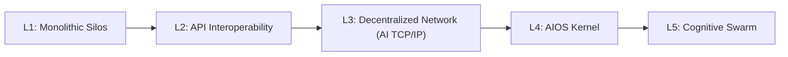
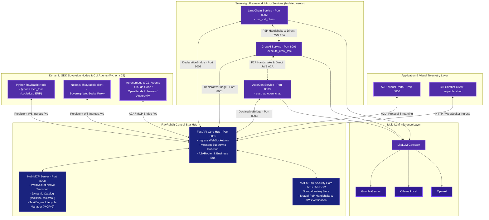

# Architecture & L3 Network Topology (AI TCP/IP + TLS + HTTP)

RayRabbit is structured as the **neutral Layer 3 (L3) transport and interoperability standard** for agentic Artificial Intelligence. Rather than forcing all agents or tools to execute inside a single monolithic framework, RayRabbit acts as the **TCP/IP, TLS, and HTTP protocol suite for autonomous AI**: abstracting communication, Zero-Trust cryptographic security, and visual telemetry into a universal horizontal mediation fabric under a **Shared-Nothing Architecture**.

---

## The Five Levels of Agentic Evolution

To guide architectural decisions, RayRabbit implements a standardized taxonomy of agentic grids:

=== "L1: Monolithic Silos"
    Agents are coupled inside the same code library (e.g., a pure CrewAI or a pure AutoGen application). They share the same operating system thread, memory space, dependencies, and language runtime. If one agent encounters a dependency bottleneck, the entire swarm crashes.

=== "L2: API Interoperability"
    Frameworks are separated into independent network endpoints (FastAPI nodes) but connected via manual, fragile REST APIs. Developers must code custom translators for each connection, security is non-existent, and message synchronization is completely blocking.

=== "L3: Decentralized & Interoperable Network (RayRabbit OSS - AI TCP/IP)"
    A true horizontal L3 infrastructure. Seamlessly connects and mediates between:
    * **Sovereign SDKs & Domain Atomic Tools**: Custom scripts and database connectors via `@node.mcp_tool`.
    * **Coding Assistants & Autonomous Agents**: Claude Code, Codex, Antigravity, OpenHands, Hermes, OpenClaw, and arbitrary $N$-Agents.
    * **Heterogeneous Cognitive Frameworks**: CrewAI, LangChain, AutoGen, Microsoft Agent Framework (MAF), LlamaIndex, and arbitrary $N$-frameworks.
    * **Declarative Visual Portals (A2UI)**: Dynamic, reactive surfaces rendered in real time.
    All exchanging standardized messages (Google A2A JSON-RPC 2.0, MCP/MCPv2, A2UI v0.9.1) with RSA-4096 JWS signatures without central orchestrators or shared global memory (*Shared-Nothing*).

=== "L4: AIOS Kernel (RayRabbit Enterprise)"
    An intent-based containerization kernel. The infrastructure is managed dynamically using natural language. The system provisions sovereign virtual machines in MicroVMs or WebAssembly (`wasmtime`), manages enterprise KMS/HSM keys, inspects cognitive reasoning with **AIDA Ouroboros**, and throttles resources (GPU context window tokens) dynamically.

=== "L5: Cognitive Swarm (Roadmap)"
    Autonomous cognitive grids capable of self-healing topologies, dynamic logic adaptation, and global P2P resource optimization. See our [roadmap](../roadmap.md) for details.

---

## Sovereign Star Topology

RayRabbit implements a **Sovereign Star Topology** with a *Shared-Nothing* architecture, where the central Hub provides horizontal mediation, tool catalogs, and Zero-Trust security without controlling the cognitive reasoning of connected agents:

---

## Communication Modes & Network Deployments

RayRabbit provides operational flexibility across two configuration dimensions in `config.yaml`:

### 1. Discovery Strategy (`discovery.communication_mode`)
- **`bridge` (Declarative Bridge - Default Zero-Code)**: Framework microservices expose OpenAPI schemas (`/openapi.json`). The Hub automatically binds them to dynamic pub/sub channels on the MessageBus with 0% code modifications required on the target agent.
- **`p2p` (Sovereign Peer-to-Peer)**: Agents negotiate directly using A2A (JSON-RPC 2.0) and MCP, verifying identity via a **Mutual Proof of Possession (Mutual PoP)** challenge with PEM certificates and RSA-4096 JWS signatures.

### 2. Network Modes per Service (`external_services.mode`)
- **`local`**: Services hosted on the same machine or local container bridge (`127.0.0.1` / Docker network).
- **`remote`**: Remote services running in external corporate VPCs or multicloud environments communicating securely over HTTPS/WSS with strict cryptographic validation.

---

## Virtual Context & Infinite Memory Subsystem (Active R&D)

Inspired by operating system virtual memory paging and swap architectures, RayRabbit provides an OS-level **L3 Virtual Context Subsystem**:

- **Hierarchical Memory Paging**: Agents page, swap, and retrieve memory blocks dynamically between the LLM's active working window, a hot MCP tool cache, and cold immutable SQLite storage.
- **Context Continuity**: Prevents catastrophic forgetting and context degradation during long-running multi-turn workflows without unbounded context token costs.
