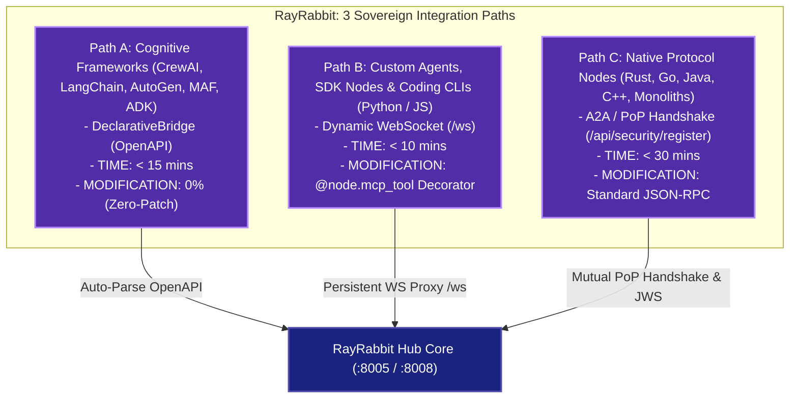

# Service Federation & Remote Clusters

RayRabbit supports both highly integrated single-host execution and globally distributed, multi-cloud **Service Federation**. This allows organization units to run sovereign nodes in their private VPCs while collaborating securely.

---

## The 3 Sovereign Integration Paths (BYOA - Bring Your Own Agent)

RayRabbit connects **any agent, framework, SDK, CLI, or language** into a sovereign peer-to-peer network without translation middleware or code rewrites:



| Integration Path | Supported Agent Types | Protocol / Transport | Setup Time | Code Impact |
| :--- | :--- | :--- | :---: | :---: |
| **Path A — DeclarativeBridge** | CrewAI, LangChain, AutoGen, Microsoft Agent Framework (MAF), LlamaIndex, ADKs | OpenAPI / REST sidecar | **< 15 min** | **0% (Zero-Patch)** |
| **Path B — Sovereign WebSocket** | Python Nodes (`rayrabbit_client`), TypeScript (`@rayrabbit-client`), Coding CLIs (Claude Code, Codex, Antigravity, OpenHands, Hermes) | Persistent WebSocket (`/ws`) | **< 10 min** | 1 decorator (`@node.mcp_tool`) |
| **Path C — Native Protocol** | Rust, Go, Java, C++ agents, autonomous monoliths | Google A2A (JSON-RPC 2.0) + Mutual PoP Handshake | **< 30 min** | Standard JSON-RPC 2.0 |

---

## Local vs Remote Topologies

In standard deployments, all micro-services reside on the same network node. RayRabbit manages routing as follows:

```
[Local Mode]      ==>  FastAPI / WS Nodes ──> localhost Loopback (127.0.0.1)
[Remote Mode]     ==>  Distributed Gateway ──> HTTPS/WSS with Strict JWS Validation
```

---

## Configuring Nodes in `config.yaml`

To deploy a node on a remote server or corporate VPC, simply configure its `mode` parameter to `remote` and supply its WAN address in `config.yaml`:

```yaml
discovery:
  strategy: "static"
  communication_mode: "p2p"  # 'bridge' or 'p2p'

external_services:
  - name: "crewai_service"
    address: "https://crewai.prod.rayrabbit.io"
    mode: "remote"  # <--- Core routes traffic applying RSA-4096 JWS signatures
    topics: ["crewai_service_bridge"]
    network:
      timeout_total: 120
      max_retries: 3
```

When configured as `remote`, the connector redirects pub/sub traffic dynamically through the secure Gateway, applying JWS signatures and verifying certificates before sending packages across the public Internet.

---

## Core Sovereign Agents in RayRabbit OSS

To coordinate federation, security, and tool discovery, RayRabbit OSS defines **three specialized system agents** residing under the `rayrabbit/agents` directory. These are fully active in the open-source codebase:

```
                  ┌─────────────────────────────────┐
                  │      RayRabbit Core Hub         │
                  └────────┬───────────────┬────────┘
                           │               │
       ┌───────────────────┴───┐       ┌───┴───────────────────┐
       │   KeyExchangeAgent    │       │   ToolCallingAgent    │
       │  - secure key swap    │       │  - discover tools     │
       │  - signs handshakes   │       │  - executes calls     │
       └───────────────────────┘       └───────────────────────┘
                                   (Outbound WAN)
                                           │
                                           ▼
                               ┌───────────────────────┐
                               │     GatewayAgent      │
                               │  - mTLS WAN bridge    │
                               │  - encrypts payloads  │
                               └───────────────────────┘
```

### 1. The Gateway Agent (`GatewayAgent`)
The `GatewayAgent` is the WAN boundary guard. When active in remote mode:
* **Outbound Interception**: It registers a hook in the local `MessageBus`. If an outbound message is addressed to a remote instance, it intercepts it, encodes the dictionary payload to JSON, encrypts it using the recipient's public identity key, and posts the cryptocell over the network via the external HTTP transport.
* **Inbound Decryption**: It listens to incoming encrypted messages from federated peers, decrypts the bytes using its private key, deserializes the JSON, and publishes the clean message onto the local MessageBus.

### 2. The Key Exchange Agent (`KeyExchangeAgent`)
Security in RayRabbit relies on a peer-to-peer trust model. The `KeyExchangeAgent` manages public keys between instances:
* It subscribes to the `KEY_EXCHANGE_REQUEST` topic on the MessageBus.
* Upon capturing a request, it loads the node's public identity key PEM from the local key store / MAESTRO security engine facade.
* It wraps the key PEM inside a `KEY_EXCHANGE_RESPONSE` and publishes it back to the requesting agent, enabling zero-touch secure key swaps during handshakes.

### 3. The Tool Calling Agent (`ToolCallingAgent`)
The `ToolCallingAgent` allows internal core agents to interact with external microservices seamlessly:
* **Tool Discovery**: It connects to remote `/mcp/tools` endpoints, parsing tool specifications and updating its memory catalog dynamically.
* **Tool Execution**: When an internal agent calls a tool, the `ToolCallingAgent` compiles the arguments into an MCP-compliant `MCPToolCallRequest`, signs the call, POSTs it to `/mcp/call` on the target service, and returns the parsed markdown string.

---

!!! enterprise "Enterprise Orchestration & Automated Keys"
    For large-scale, multi-region agent deployments, manual certificate and key distribution can be centralized and automated. RayRabbit Enterprise supports automated cluster provisioning, centralized certificate authority management, and dynamic key distribution for large-scale peer federation.
