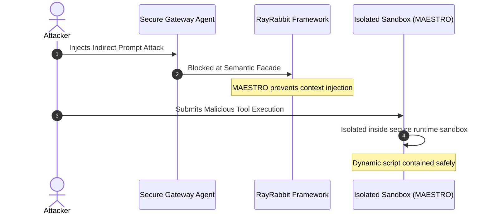

# Request a Technical Demo

Experience the power of RayRabbit Enterprise in action. See how our secure, decentralized, zero-trust interoperability infrastructure protects multi-agent workflows from real-world threats.

---

## What to Expect in the Demo

During our 30-minute deep-dive session, a senior systems architect will walk you through live scenarios showcasing RayRabbit's unique security capabilities:

### 1. Zero-Trust Peer-to-Peer mTLS Secure Channels
* **Scenario:** Dynamic cryptographic handshakes between heterogeneous frameworks, SDK nodes, and CLI assistants running in separate VPCs or organizations.
* **Outcome:** E2E encryption with zero central coordinators, proving true decentralized sovereignty.

### 2. MAESTRO Active Sandboxing (Indirect Prompt Injection Shielding)
* **Scenario:** An external LLM attempts to execute a malicious file system command or database drop query generated from user input.
* **Outcome:** Watch the MAESTRO system intercept and quarantine the execution inside an isolated sandbox runtime instantly.

### 3. High-Performance Outbox Queue & SIEM Audits
* **Scenario:** Inducing networking failures between autonomous agents during order fulfillment.
* **Outcome:** See the Outbox queue seamlessly store, retry, and log audit trails directly into an immutable WORM database streamed to your enterprise SIEM.

---

## Schedule Your Custom Demo

To schedule a dedicated session for your engineering and security team, choose your preferred method:

  

 <strong style="color: #25D366; font-size: 16px;"> Fast Booking via WhatsApp</strong>
    
Coordinate day and time directly with our technical team.

  

  <a href="https://wa.me/5491124055854?text=Hello%2C%20I%20would%20like%20to%20schedule%20a%20Technical%20Demo%20for%20RayRabbit%20Enterprise." target="_blank" rel="noopener noreferrer" class="cta-button whatsapp">
 Schedule via WhatsApp
  </a>

* ** Dedicated Booking Desk:** [Contact RayRabbit Development Team](mailto:sdichiera@duck.com?subject=Request%20Technical%20Demo)
* **⏱ Average Response SLA:** Under 2 hours (business days)
* ** Custom Proof-of-Concept (PoC):** Available for Enterprise customers requiring isolated deployments.

 <a href="../contact/" class="cta-button primary"> Contact Form & Architecture</a>
 <a href="../pricing/" class="cta-button outline"> View Plans & Pricing</a>
 <a href="https://wa.me/5491124055854?text=Hello%2C%20I%20would%20like%20to%20request%20a%20Technical%20Demo." target="_blank" rel="noopener noreferrer" class="cta-button whatsapp"> WhatsApp Direct</a>

