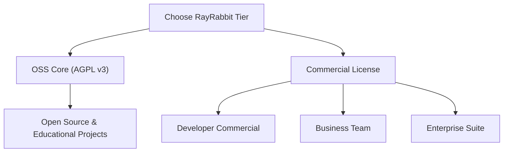

# Enterprise Plans & Infrastructure Philosophy

RayRabbit is not an agent framework; it is the **Universal Interoperability Infrastructure (A2A, MCP, A2AUI)**. Our purpose is to seamlessly connect heterogeneous agent frameworks (LangChain, CrewAI, AutoGen), SDKs, ADKs, and enterprise legacy systems under a decentralized, secure network standard with no single points of failure.

---

## Market Positioning & Value Analysis

When evaluating the cost of adopting RayRabbit Enterprise, organizations should not compare it to the cost of an individual agent orchestration framework (which are natural allies that RayRabbit unifies), but rather to the cost of designing, certifying, and maintaining a **custom zero-trust secure communication infrastructure**:

| Integration Path | Estimated Engineering Cost | Implementation Time | Security Paradigm | Interoperability Guarantee |
| :--- | :--- | :--- | :--- | :--- |
| **In-House Ad-Hoc Integrations** | High Engineering Cost (Multiple dedicated security/networking engineers) | 6 to 9 months | Manual & Fragmented (High risk of prompt injection, key rotation failures, or transport security gaps) | Low (Fragile custom APIs; requires rewriting connectors whenever agent frameworks upgrade) |
| **Centralized Integration Platforms** | Subscription & hosting overhead costs | 3 to 6 months | Centralized (Single point of failure, data exposure during intermediate decryption) | Medium (Lock-in to proprietary connectors provided by a single middleware vendor) |
| **RayRabbit Enterprise Suite** | Flat annual subscription | **Immediate (IaC automated deployment)** | **Zero-Trust Native** (Active sandboxing, JWS cryptosigned transactions, local KMS integrations) | **Total** (100% Neutral; bridges LangChain, CrewAI, and AutoGen without modifying native logic) |

### The ROI of RayRabbit Enterprise:
RayRabbit eliminates the need for your systems engineering teams to design custom security wrappers around LLM agent tools. By acting as a **universal network layer (analogous to HTTP for the web or Kubernetes for containers)**, it cuts deployment cycles of distributed multi-agent systems from months to minutes, delivering SOC2 and NIST compliance out-of-the-box.

---

## Infrastructure Licensing Tiers

Select the infrastructure plan that best fits your agent network volume, security requirements, and operational compliance.

### 1. Developer Commercial
For independent developers or startups building commercial closed-source applications who need exemption from the viral copyleft requirements of the AGPL v3 license.

* **Pricing:** Contact Sales for Startup and Developer licensing options.
* **Capacity:** Unlimited local development network.
* **Included Features:**
  * Royalty-free commercial use of the RayRabbit core.
  * Interconnect unlimited local multi-framework agents (LangChain, CrewAI, AutoGen).
  * Standard local A2UI dashboard execution.
  * Community support via Discord and GitHub.

### 2. Business Team
Designed for engineering teams deploying active agent clusters in private clouds or local networks that require high-availability asynchronous messaging.

* **Pricing:** Custom annual team subscription options available.
* **Capacity:** Supports high-availability outbox queues for active agents in the network.
* **Included Features:**
  * Everything in Developer Commercial.
  * **Outbox Pattern Core:** Persistent transaction queue resilient against network drops or LLM API rate limits.
  * Multi-region local service discovery clustering.
  * Secure local KMS / Vault integration templates.
  * SLA Email support.

### 3. Enterprise Suite
The ultimate cryptographic isolation, immutable auditing, and active security infrastructure package for global IT operations and highly regulated sectors.

* **Pricing:** Custom annual enterprise contracts.
* **Capacity:** Unlimited agents and nodes, secure federated channels across cross-organization clouds.
* **Included Features:**
  * **mTLS Perimeter Gateways:** Secure cross-boundary and cross-organization agent routing.
  * **MAESTRO Active Security Suite:**
    * *Indirect Injection Shield:* Active semantic sanitization of LLM contexts to block AIDA injection attacks.
    * *isolated sandboxing Active Sandboxing:* Physical runtime isolation of LLM tool actions inside lightweight isolated sandboxing micro-sandboxes.
  * **Hardware HSM Custody:** Volatile RAM cryptographic signing key custody with automated vault/HSM key rotation.
  * **SIEM Audits (WORM):** Real-time transactional streams directly into central corporate enterprise SIEM platforms.
  * **IaC Deployment:** Industry-standard HCL pipeline recipes for automated, compliant private VPC provisioning.
  * **24/7/365 Premium SLA:** Dedicated Slack/Teams engineers and < 2-hour critical response times.

---

## Network Capabilities Matrix

| Infrastructure Capability | OSS Core (AGPL v3) | Developer | Business | Enterprise |
| :--- | :---: | :---: | :---: | :---: |
| **Commercial License Exemption** | ✕ (AGPL) | ✓ | ✓ | ✓ |
| **A2A / MCP / A2UI Protocols** | ✓ | ✓ | ✓ | ✓ |
| **Multi-Framework Integration** | ✓ | ✓ | ✓ | ✓ |
| **Outbox Message Queue** | Standard | Standard | Advanced (Persistent) | Maximum Resiliency |
| **mTLS Cross-Org Gateways** | ✕ | ✕ | ✕ | ✓ (Gateway Agent) |
| **Active Isolated Sandboxing** | ✕ | ✕ | ✕ | ✓ (Hypervisor) |
| **SIEM Stream (WORM)** | ✕ | ✕ | ✕ | ✓ (Enterprise SIEM) |
| **Key Custody KMS** | Local File | Local File | Local Vault | Hardware HSM / Vault |
| **SLA Support** | Community | Community | 24-hr Email | 24/7 Premium (2-hr) |

---

## Secure Your Infrastructure Today

Provide your AI agent networks with the highest tier of resilience, zero-trust security, and corporate compliance.

 <a href="../demo/" class="cta-button primary"> Request Technical Demo</a>
 <a href="../contact/" class="cta-button secondary"> Contact Form</a>
 <a href="https://wa.me/5491124055854?text=Hello%2C%20I%20would%20like%20to%20inquire%20about%20RayRabbit%20pricing%20and%20plans." target="_blank" rel="noopener noreferrer" class="cta-button whatsapp"> WhatsApp Sales</a>

