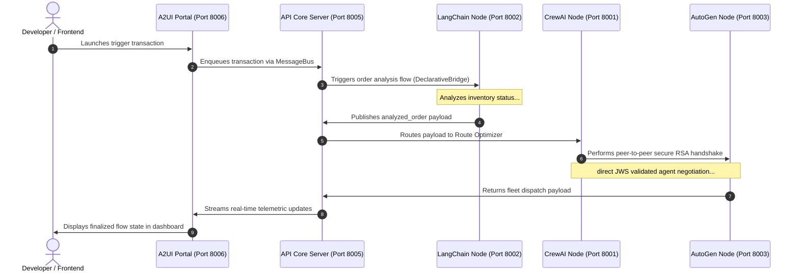

# Quickstart Guide

This guide will walk you through launching a complete heterogeneous AI agent cluster locally on your system using RayRabbit. You will run three sovereign services (LangChain, CrewAI, AutoGen) communicating asynchronously, managed by the Core Hub, and monitor their live interaction via the visual A2UI Portal.

---

## 1. Unified CLI Bootstrapping

RayRabbit provides an integrated CLI to manage services, clusters, and interactive terminal clients:

```bash
# Option A: All-in-One (Launches cluster in background and opens interactive chatbot)
rayrabbit start

# Option B: Step-by-Step Launch
# Terminal 1: Launch Hub Core, MCP Server, Services, and A2UI Web Portal
rayrabbit cluster

# Terminal 2: Open Interactive Terminal Chatbot
rayrabbit chat
```

---

## 2. Create a Sovereign Node in 4 Lines (Path B)

Connect any Python script, domain tool, or database connector to the grid as an instantly discoverable sovereign node:

```python
from rayrabbit_client import RayRabbitNode

# Connect to the Hub over persistent WebSocket
node = RayRabbitNode(agent_id="logistics_node", hub_url="ws://127.0.0.1:8005/ws")

@node.mcp_tool(category="logistics")
def get_shipment_status(order_id: str) -> dict:
    return {"order_id": order_id, "status": "IN_TRANSIT", "eta": "14:30"}

node.start()  # Instantly available to CrewAI, LangChain, and A2UI
```

---

## 3. Port Architecture & A2UI Dashboard

When running `rayrabbit cluster`, the following local endpoints are initialized:

1. **FastAPI Core Hub**: `http://127.0.0.1:8005` (Ingress WebSocket `/ws`, A2ARouter & MessageBus)
2. **Hub MCP Server**: `ws://127.0.0.1:8008` (Dynamic tool catalog & TaskEngine MCPv2)
3. **CrewAI Sovereign Node**: `http://127.0.0.1:8001` (`execute_crew_task`)
4. **LangChain Sovereign Node**: `http://127.0.0.1:8002` (`run_lcel_chain`)
5. **AutoGen Sovereign Node**: `http://127.0.0.1:8003` (`start_autogen_chat`)
6. **A2UI Web Portal Node**: `http://127.0.0.1:8006` (Reactive UI streaming dashboard)

Open your browser and navigate to:
👉 **[http://127.0.0.1:8006](http://127.0.0.1:8006)** to monitor live agent-to-agent negotiations in real-time.

---

## Local Component Flow

Here is how data flows in real-time under the default local cluster setup:



---

!!! enterprise "RayRabbit Enterprise: Mass-Enrollment"
    In the local playground, nodes are started by the developer locally and discover each other via a static `AGENTS.md` manifest.
    
    In corporate environments running **RayRabbit Enterprise**, you don't boot nodes manually. The **Hypervisor Agent** acts as an AIOS Kernel. Upon parsing natural language orders, the Hypervisor automatically instantiates secure container runtimes, performs mass enrollment of credentials, mounts the compliance and runtime security layers, and establishes secure service federation.
