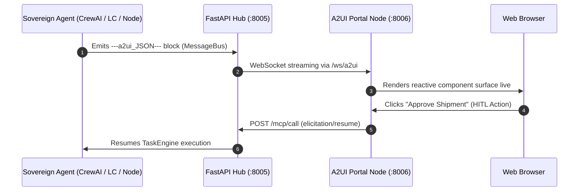

# A2UI Visual Portal & Sovereign Agent (v0.9.1)

The **A2UI Portal** and the **`SovereignA2UIAgent`** constitute RayRabbit's declarative visual telemetry layer. Operating on **Port `:8006`** and consuming the Hub's `/ws/a2ui` streaming channel, they render reasoning steps, interactions, and user controls in real-time with zero front-end code rebuilds.

---

## The Sovereign A2UI Agent (`SovereignA2UIAgent`)

The `SovereignA2UIAgent` is a plug-and-play visual telemetry agent designed to adapt seamlessly across diverse cognitive patterns:

1. **Sequential Chains (LCEL)**: Step-by-step telemetry of intermediate transformations and execution latencies.
2. **Hierarchical Squads (CrewAI)**: Renders organizational delegation trees (Manager Agent $\rightarrow$ Worker Agents).
3. **Human-in-the-Loop (HITL) Approvals**: Dynamically generates interactive approval cards and forms that pause task execution in the `TaskEngine` until user feedback is received.
4. **Evaluator-Optimizer Loops**: Side-by-side evaluation scores, diffs, and retry iterations.
5. **Multi-Agent Group Chats (AutoGen)**: Real-time turn-taking dialogue visualization and consensus logs.

---

## A2UI Protocol Primitives (v0.9.1)

AI agents do not write HTML or React code. Instead, they emit declarative JSON blocks tagged with `---a2ui_JSON---`:

```json
{
  "protocol": "a2ui/v0.9.1",
  "action": "surfaceUpdate",
  "surface_id": "logistics_monitor",
  "components": [
    {
      "type": "MetricCard",
      "props": {
        "title": "DeepRoute Route Optimization",
        "value": "24h ETA",
        "status": "active",
        "badge": "DHL Express",
        "progress": 82
      }
    }
  ]
}
```

### Visual Lifecycle Primitives:
* `beginRendering`: Initializes the visual surface in web clients and allocates viewport layout space.
* `surfaceUpdate`: Reactively updates component trees without page reloads.
* `updateDataModel`: Synchronizes background state variables and metrics seamlessly.

---

## Front-End Client Packages

RayRabbit provides TypeScript packages with strict Zod validation:
* **`@rayrabbit-a2ui`**: Core React/Web Component renderer that consumes `---a2ui_JSON---` events.
* **`clients/javascript/apps/sdk-a2ui`**: Production-ready reference application featuring dark/light glassmorphic UI themes.

---

## Streaming Topology



---

!!! enterprise "Enterprise Security & Corporate Telemetry"
    For production environments, telemetry channels can be fully encrypted, access-controlled, and audited. RayRabbit Enterprise integrates seamlessly with corporate Single Sign-On (SSO) systems (OIDC/SAML) and pipes event streams directly into enterprise SIEM compliance systems.
