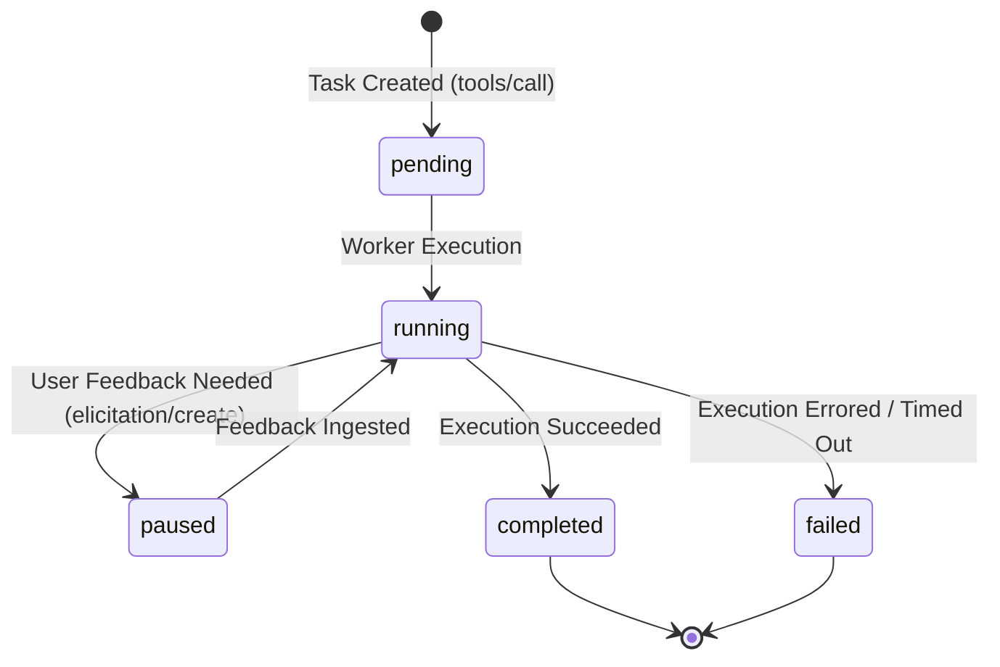

# Model Context Protocol (MCP / MCPv2) Specification

The **Model Context Protocol (MCP)** by Anthropic standardizes how large language models (LLMs) and autonomous agents discover capabilities, inject local context, and execute physical tools. RayRabbit incorporates a native MCP server running over WebSocket on **Port `:8008`** alongside standard HTTP API endpoints.

---

## Native MCP Server (`ws://127.0.0.1:8008`)

The Central Hub manages an in-memory unified catalog with full support for native MCP primitives:
* `tools/list`: Returns a consolidated catalog of all capabilities exposed by SDK nodes, framework bridges, and database connectors.
* `tools/call`: Dispatches and executes tools asynchronously with JWS signature verification and schema enforcement.

---

## Dynamic Metadata Classification & Disambiguation

To prevent static hardcoding and allow LLMs to infer tool usage agnostically, every tool in RayRabbit **MUST** declare a dynamic `category` or `namespace` attribute in its JSON Schema 2020-12 definition:

```json
{
  "name": "query_erp_inventory",
  "description": "Queries real-time physical stock levels and warehouse allocations.",
  "category": "inventory",
  "inputSchema": {
    "type": "object",
    "properties": {
      "sku": {
        "type": "string",
        "description": "Unique product SKU code (e.g. SKU-98124)"
      }
    },
    "required": ["sku"]
  }
}
```

### Architectural Disambiguation Rule
The MCP catalog dynamically distinguishes between two categories of capabilities:
1. **Domain Atomic Tools (SDK)**: Atomic functions registered via `@node.mcp_tool(category="...")` or client SDKs.
2. **Cognitive Orchestration Tasks**: High-level multi-step framework tasks (e.g. `execute_crew_task`, `run_lcel_chain`).

---

## Asynchronous TaskEngine (MCPv2)

For operations requiring long-running executions or human interaction, RayRabbit implements the `TaskEngine` (`rayrabbit/core/task_engine/`):



### TaskEngine Capabilities:
- **Transactional Lifecycle**: SQLite-backed state machine tracking (`pending` $\rightarrow$ `running` $\rightarrow$ `completed` | `failed` | `paused`).
- **Dynamic Elicitation (`elicitation/create`)**: Agents can pause execution mid-flight and request user confirmation or missing arguments via the A2UI dashboard.
- **Progress Streaming**: Emits live telemetry events containing percentage completion and structured log traces.

---

## Tool Registration with Python SDK

```python
from rayrabbit_client import RayRabbitNode

node = RayRabbitNode(agent_id="finance_service", hub_url="ws://127.0.0.1:8005/ws")

@node.mcp_tool(category="finance")
def generate_invoice(customer_id: str, amount: float) -> dict:
    """Generates an electronic invoice validated by the accounting system."""
    return {"invoice_id": "INV-2026-001", "status": "ISSUED", "amount": amount}

node.start()
```
