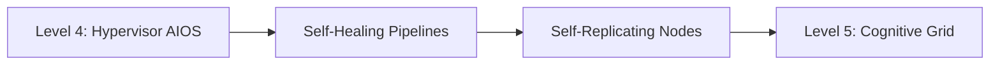

# Roadmap: Level 5 Cognitive Swarms

RayRabbit's mission is to establish the universal, decentralized infrastructure for AI agent interoperability. Below is our strategic timeline, bridging our current achievements with our vision for autonomous, self-healing agent grids.

---

## Roadmap Timeline

### Phase 1: Core Protocol Stabilization (Completed)
* Standardize **A2A** message formats over JSON-RPC.
* Implement native **Anthropic MCP** server parameters.
* Release **A2UI** declarative portal telemetry.

### Phase 2: Zero-Trust Governance (Active)
* Enforce compact cryptographic signatures using robust key exchanges.
* Integrate structured transaction auditing loops.
* Standardize the **RayRabbit ARK** compliance wrapper adapters.

### Phase 3: AIOS Virtualized Kernel (Active)
* Launch the **Enterprise Hypervisor Agent**.
* Automate intent-based container provisioning using industry-standard HCL templates.
* Sandbox code execution inside stateless isolated runtimes.

### Phase 4: Swarm Micro-Markets (Roadmap)
* Enable autonomous peer-to-peer economic networks.
* Allow agents to trade compute resources, credit pipelines, and tool capabilities dynamically using micro-transactions.
* Integrate decentralized ledgers for zero-trust billing across organizations.

---

## Level 5: Autonomous & Auto-Evolutive Swarms

The final step in our agentic taxonomy is **Level 5 - Cognitive Auto-Evolutive Swarms**. 

At Level 5, the agentic network ceases to be a static configuration of container instances. It becomes an **automorphic grid**:
1. **Self-Healing Topologies**: If an agent node goes offline or returns high error rates, the Hypervisor autonomously spins up a replacement instance, transfers security keys, and redirects MessageBus queues without human developer intervention.
2. **Dynamic Logic Adaptation**: Agents analyze the performance of remote tools via A2UI logs. If a remote tool is too slow or too expensive, the agent automatically negotiates contracts with alternative providers inside the open marketplace, selecting the optimal combination dynamically.
3. **Decentralized Cognitive Grids**: Swarms execute logic globally, federating edge nodes across diverse clouds and private servers, optimizing latency, compute costs, and sovereignty parameters in real-time.
