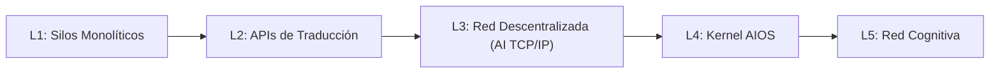
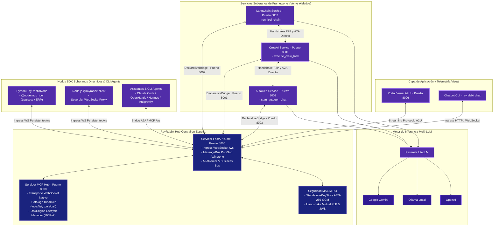

# Arquitectura y Topología de Red L3 (AI TCP/IP + TLS + HTTP)

RayRabbit está estructurado como una **capa neutral de transporte e interoperabilidad L3** para la Inteligencia Artificial agéntica. En lugar de forzar a todos los agentes o herramientas a ejecutarse dentro de un mismo proceso o framework, RayRabbit actúa como el equivalente a **TCP/IP, TLS y HTTP para agentes autónomos**: abstrae las comunicaciones, la seguridad criptográfica Zero-Trust y la telemetría visual en una infraestructura común asíncrona de mediación horizontal bajo una arquitectura **Shared-Nothing**.

---

## Los Cinco Niveles de Evolución Agéntica

Para guiar las decisiones de diseño del ecosistema agéntico, RayRabbit utiliza una taxonomía técnica de 5 niveles:

=== "L1: Silos Monolíticos"
    Los agentes se limitan a un mismo framework (ej. solo CrewAI o solo AutoGen). Comparten el hilo de ejecución física del sistema operativo, el espacio de memoria RAM, dependencias de librerías y el runtime. Si un agente sufre un conflicto de paquetes o bloqueo, colapsa todo el flujo.

=== "L2: APIs de Traducción"
    Los agentes se aíslan en procesos separados (FastAPI) pero se comunican mediante APIs REST ad-hoc manuales. Requiere codificar traductores personalizados por cada conexión, carece de estándares de red y la sincronización es síncrona y bloqueante.

=== "L3: Red Descentralizada e Interoperable (RayRabbit OSS - AI TCP/IP)"
    Una verdadera infraestructura horizontal L3. Conecta y media entre:
    * **SDKs Soberanos & Herramientas Atómicas de Dominio**: Scripts y conectores de bases de datos mediante `@node.mcp_tool`.
    * **Asistentes de Código & Agentes Autónomos**: Claude Code, Codex, Antigravity, OpenHands, Hermes, OpenClaw y $N$-Agentes.
    * **Frameworks Cognitivos Heterogéneos**: CrewAI, LangChain, AutoGen, Microsoft Agent Framework (MAF), LlamaIndex y $N$-frameworks.
    * **Portales Visuales Declarativos (A2UI)**: Superficies reactivas en tiempo real.
    Todo ello intercambiando mensajes estandarizados (Google A2A JSON-RPC 2.0, MCP/MCPv2, A2UI v0.9.1) con firmas JWS RSA-4096 sin orquestadores centrales ni memoria global compartida (*Shared-Nothing*).

=== "L4: Kernel AIOS (RayRabbit Enterprise)"
    Una capa de infraestructura gestionada por intenciones (IaC). El sistema interpreta órdenes en lenguaje natural y aprovisiona de forma autónoma contenedores seguros en MicroVMs o WebAssembly (`wasmtime`), administra llaves KMS/HSM corporativas, evalúa razonamientos con **AIDA Ouroboros** y aplica límites de cuotas de tokens y GPU de forma activa.

=== "L5: Red Cognitiva (Roadmap)"
    Redes agénticas cognitivas y auto-evolutivas capaces de gestionar topologías auto-reparables, selección dinámica de herramientas en marketplaces abiertos y federaciones distribuidas en el borde. Consulte nuestro [roadmap](../roadmap.md) para más detalles.

---

## Topología en Estrella Soberana

RayRabbit implementa una **Topología en Estrella Soberana** con arquitectura *Shared-Nothing*, donde el Hub central proporciona mediación horizontal, catálogo de herramientas y seguridad Zero-Trust sin controlar el ciclo de vida cognitivo de los agentes:

---

## Modos de Comunicación y Despliegue de Red

RayRabbit ofrece flexibilidad operativa a través de dos dimensiones de configuración en `config.yaml`:

### 1. Estrategia de Descubrimiento (`discovery.communication_mode`)
- **`bridge` (Declarative Bridge - Defecto Zero-Code)**: Los microservicios de frameworks exponen endpoints OpenAPI (`/openapi.json`). El Hub genera automáticamente canales dinámicos en el MessageBus sin exigir modificaciones al código fuente original.
- **`p2p` (Peer-to-Peer Nativo Soberano)**: Los agentes negocian directamente mediante A2A (JSON-RPC 2.0) y MCP, autenticándose mediante un **Handshake Criptográfico Bidireccional Mutuo (Mutual PoP)** con certificados PEM y firmas JWS RSA-4096.

### 2. Modos de Red por Servicio (`external_services.mode`)
- **`local`**: Servicios ejecutados en el mismo host o en red local de contenedores (`127.0.0.1` / Docker network).
- **`remote`**: Servicios distribuidos en otras redes corporativas, VPCs o multicloud sobre HTTPS/WSS con verificación criptográfica estricta.

---

## Subsistema de Contexto Virtual y Memoria Ilimitada (I+D Activo)

Inspirado en los mecanismos de paginación y memoria virtual de los sistemas operativos modernos, RayRabbit incorpora un subsistema de **Memoria Virtual L3 para LLMs**:

- **Paginación Jerárquica de Memoria**: Permite a los agentes paginar, conmutar (swap) y recuperar dinámicamente bloques de contexto entre la memoria RAM de trabajo del modelo, una caché caliente de herramientas MCP y un almacenamiento frío inmutable en SQLite.
- **Continuidad de Contexto**: Elimina la degradación y el olvido catastrófico en ejecuciones agénticas de larga duración sin requerir ventanas de contexto infinitas ni costes computacionales excesivos.
