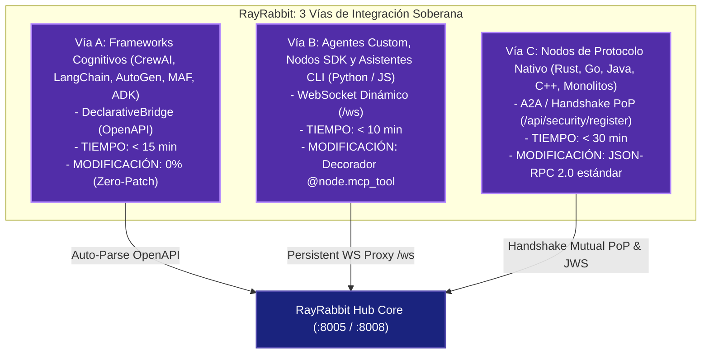

# Federación de Servicios y Clústeres Remotos

RayRabbit está diseñado para soportar tanto ejecuciones locales integradas en un único host como complejas arquitecturas de **Federación de Servicios** a nivel global y multi-nube, permitiendo a diferentes unidades de negocio operar nodos soberanos en sus propias redes privadas colaborando de forma totalmente segura.

---

## Las Tres Vías de Integración Soberana (BYOA - Bring Your Own Agent)

RayRabbit permite federar **cualquier agente, framework, SDK, CLI o lenguaje** en una red peer-to-peer soberana sin traductores intermediarios ni necesidad de reescribir código:



| Vía de Integración | Tipos de Agentes Compatibles | Protocolo / Transporte | Tiempo de Setup | Impacto en Código |
| :--- | :--- | :--- | :---: | :---: |
| **Vía A — DeclarativeBridge** | CrewAI, LangChain, AutoGen, Microsoft Agent Framework (MAF), LlamaIndex, ADKs | OpenAPI / REST sidecar | **< 15 min** | **0% (Zero-Patch)** |
| **Vía B — Sovereign WebSocket** | Nodos Python (`rayrabbit_client`), TypeScript (`@rayrabbit-client`), Asistentes CLI (Claude Code, Codex, Antigravity, OpenHands, Hermes) | WebSocket persistente (`/ws`) | **< 10 min** | 1 decorador (`@node.mcp_tool`) |
| **Vía C — Protocolo Nativo** | Agentes en Rust, Go, Java, C++, monolitos autónomos | Google A2A (JSON-RPC 2.0) + Mutual PoP Handshake | **< 30 min** | JSON-RPC 2.0 estándar |

---

## Topologías Local vs Remota

En implementaciones de desarrollo estándar, todos los microservicios residen en el mismo nodo físico. RayRabbit gestiona las interfaces de red de la siguiente forma:

```
[Modo Local]   ==>  Nodos FastAPI / WS ──> Loopback de localhost (127.0.0.1)
[Modo Remoto]  ==>  Gateway Distribuido ──> Transporte Seguro HTTPS/WSS con Validación JWS
```

---

## Configuración de Nodos en `config.yaml`

Para desplegar un microservicio de agente en un servidor remoto o VPC corporativa, configure el parámetro `mode` en `remote` y detalle su dirección de red en `config.yaml`:

```yaml
discovery:
  strategy: "static"
  communication_mode: "p2p"  # 'bridge' o 'p2p'

external_services:
  - name: "crewai_service"
    address: "https://crewai.produccion.rayrabbit.io"
    mode: "remote"  # <--- Core canaliza el tráfico aplicando cifrado y firmas JWS RSA-4096
    topics: ["crewai_service_bridge"]
    network:
      timeout_total: 120
      max_retries: 3
```

Al marcar un nodo como `remote`, el conector encamina los mensajes del MessageBus a través del Gateway seguro de red, validando cabeceras y firmas JWS antes de enviar paquetes a través de la WAN pública.

---

## Agentes Soberanos del Sistema en RayRabbit OSS

Para coordinar la federación de red, el intercambio criptográfico y el descubrimiento dinámico de herramientas, RayRabbit OSS define **tres agentes de sistema especializados** que residen en el directorio `rayrabbit/agents`. Estos componentes están 100% operativos en el núcleo open-source:

```
                  ┌─────────────────────────────────┐
                  │      RayRabbit Core Hub         │
                  └────────┬───────────────┬────────┘
                           │               │
       ┌───────────────────┴───┐       ┌───┴───────────────────┐
       │   KeyExchangeAgent    │       │   ToolCallingAgent    │
       │  - intercambio llaves │       │  - descubre mcp tools │
       │  - firma handshakes   │       │  - ejecuta llamadas   │
       └───────────────────────┘       └───────────────────────┘
                                   (Salida WAN)
                                        │
                                        ▼
                               ┌───────────────────────┐
                               │     GatewayAgent      │
                               │  - puente mTLS WAN    │
                               │  - cifra payloads     │
                               └───────────────────────┘
```

### 1. El Agente de Pasarela (`GatewayAgent`)
El `GatewayAgent` es el guardián perimetral de red en la WAN. Cuando el sistema opera en modo remoto:
* **Intercepción Saliente**: Registra un hook en el `MessageBus` local. Si un mensaje va dirigido a un agente externo en otra máquina, lo intercepta, serializa su diccionario a JSON, lo cifra usando la clave pública de identidad del destinatario y envía el sobre cifrado a través del transporte HTTP de red.
* **Descifrado Entrante**: Escucha mensajes cifrados entrantes de otros clústeres a través del transporte externo, los descifra usando su clave privada local, deserializa el JSON y publica el mensaje plano directamente en el MessageBus local para consumo interno.

### 2. El Agente de Intercambio de Claves (`KeyExchangeAgent`)
La seguridad y validación de firmas JWS depende de un almacén de claves de confianza descentralizado. El `KeyExchangeAgent` automatiza el intercambio de claves:
* Se suscribe al topic `KEY_EXCHANGE_REQUEST` en el MessageBus local.
* Al capturar una solicitud, carga la clave pública de identidad PEM del nodo desde el almacén local de claves o el motor de seguridad MAESTRO.
* Envía la clave pública PEM firmada asimétricamente de vuelta dentro de un mensaje `KEY_EXCHANGE_RESPONSE`, resolviendo handshakes seguros sin intervención manual.

### 3. El Agente de Llamadas a Herramientas (`ToolCallingAgent`)
El `ToolCallingAgent` capacita a las IAs internas del core para interactuar de forma transparente con los microservicios externos de la compañía:
* **Descubrimiento de Herramientas**: Se conecta a los endpoints `/mcp/tools` remotos de los servicios de LangChain o CrewAI, parseando sus esquemas de entrada y manteniendo un catálogo de capacidades en memoria RAM.
* **Ejecución MCP**: Cuando un agente invoca una herramienta, el `ToolCallingAgent` estructura los argumentos en un `MCPToolCallRequest` firmado, realiza un POST al endpoint `/mcp/call` del nodo destino y retorna la cadena markdown de respuesta.

---

!!! enterprise "Orquestación Enterprise e Intercambio Automatizado"
    Para despliegues de agentes a gran escala y multi-región, la distribución manual de certificados y claves puede centralizarse y automatizarse. RayRabbit Enterprise soporta el aprovisionamiento automatizado de clústeres, gestión centralizada de autoridades de certificación e intercambio dinámico de claves para federación a gran escala.
