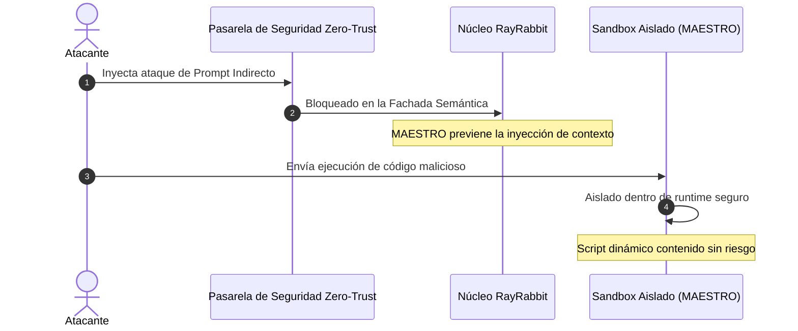

# Solicitar Demo Técnica

Experimente el poder de RayRabbit Enterprise en acción. Descubra cómo nuestra infraestructura de interoperabilidad descentralizada, segura y Zero-Trust protege los flujos de trabajo multi-agente frente a amenazas reales.

---

## Qué Esperar en la Demo

Durante nuestra sesión de análisis técnico de 30 minutos, un arquitecto senior de sistemas le guiará a través de escenarios en vivo para demostrar las capacidades únicas de seguridad de RayRabbit:

### 1. Canales mTLS Seguros Peer-to-Peer Zero-Trust
* **Escenario:** Handshakes criptográficos dinámicos entre frameworks heterogéneos, nodos SDK y asistentes CLI que se ejecutan en nubes (VPCs) u organizaciones diferentes.
* **Resultado:** Cifrado de extremo a extremo sin coordinadores centrales, demostrando soberanía de datos real.

### 2. Aislamiento Activo MAESTRO (Escudo contra Inyecciones Indirectas)
* **Escenario:** Un LLM externo intenta ejecutar un comando malicioso en el sistema de archivos o una consulta destructiva en la base de datos a partir de prompts de usuarios.
* **Resultado:** Observe cómo la suite MAESTRO intercepta la ejecución y la confina en un runtime de ejecución aislado de forma instantánea.

### 3. Cola Outbox de Alta Disponibilidad y Auditoría SIEM
* **Escenario:** Provocar caídas de red simuladas entre agentes autónomos en plena ejecución de pedidos.
* **Resultado:** Vea cómo la cola de salida *Outbox* almacena, reintenta y registra el flujo transaccional directamente en bases de datos inmutables WORM conectadas a su plataforma SIEM corporativa.

---

## Agende su Demo Personalizada

Para programar una sesión técnica dedicada para su equipo de ingeniería y seguridad de la información, elija su método preferido:

  

 <strong style="color: #25D366; font-size: 16px;"> Agendamiento Rápido por WhatsApp</strong>
    
Coordine día y horario de la demo directamente con nuestro equipo.

  

  <a href="https://wa.me/5491124055854?text=Hola%2C%20quisiera%20agendar%20una%20Demo%20T%C3%A9cnica%20de%20RayRabbit%20Enterprise." target="_blank" rel="noopener noreferrer" class="cta-button whatsapp">
 Agendar por WhatsApp
  </a>

* ** Correo Directo de Reservas:** [Contact RayRabbit Development Team](mailto:sdichiera@duck.com?subject=Solicitud%20de%20Demo%20Tecnica)
* **⏱ SLA de Respuesta Promedio:** Menos de 2 horas (días hábiles)
* ** Pruebas de Concepto (PoC) Personalizadas:** Disponibles para clientes Enterprise que requieran instalaciones aisladas en sus propias VPCs.

 <a href="../contact/" class="cta-button primary"> Formulario de Contacto / Arquitectura</a>
 <a href="../pricing/" class="cta-button outline"> Ver Planes y Precios</a>
 <a href="https://wa.me/5491124055854?text=Hola%2C%20quisiera%20agendar%20una%20Demo%20T%C3%A9cnica." target="_blank" rel="noopener noreferrer" class="cta-button whatsapp"> WhatsApp Directo</a>

