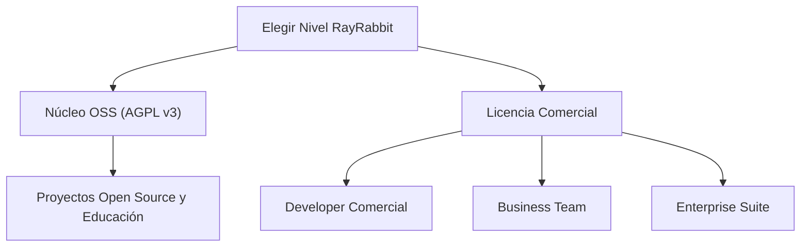

# Planes Enterprise y Filosofía de Infraestructura

RayRabbit no es un framework de agentes; es la **Infraestructura Universal de Interoperabilidad (A2A, MCP, A2AUI)**. Nuestra finalidad es conectar de forma transparente frameworks heterogéneos (LangChain, CrewAI, AutoGen), SDKs, ADKs y sistemas corporativos bajo un estándar de red descentralizado, seguro y sin puntos únicos de fallo.

---

## Posicionamiento de Mercado y Análisis de Valor

Al evaluar el costo de adoptar RayRabbit Enterprise, las organizaciones no deben compararlo con el costo de un framework de desarrollo individual (los cuales son aliados naturales que RayRabbit conecta), sino con el costo de construir, certificar y mantener una **infraestructura propia de comunicación segura y Zero-Trust**:

| Alternativa de Integración | Costo Estimado de Desarrollo | Tiempo de Implementación | Enfoque de Seguridad | Garantías de Interoperabilidad |
| :--- | :--- | :--- | :--- | :--- |
| **Integraciones Ad-Hoc Internas** | Alto costo de desarrollo (Múltiples ingenieros dedicados) | 6 a 9 meses | Manual (Riesgo de brechas en rotación de llaves, transporte y sanitización de prompts) | Baja (Acoplamiento rígido, requiere rehacer conectores al actualizar frameworks) |
| **Plataformas de Integración Centralizadas** | Costos fijos anuales y sobrecarga de hosting centralizado | 3 to 6 meses | Centralizado (Punto único de fallo, descifrado intermedio de datos sensibles) | Media (Dependencia de adaptadores propietarios de un solo proveedor) |
| **RayRabbit Enterprise Suite** | Suscripción anual plana para equipos | **Inmediato (Despliegue automatizado IaC)** | **Zero-Trust Nativo** (Aislamiento y sandboxing MAESTRO, firmas criptográficas JWS y KMS corporativo) | **Total** (Neutralidad absoluta; conecta LangChain, CrewAI y AutoGen sin modificar su lógica nativa) |

### El Retorno de Inversión (ROI) de RayRabbit:
RayRabbit elimina la necesidad de que tus equipos de seguridad e infraestructura diseñen protocolos criptográficos personalizados para cada agente. Al actuar como una **capa de red universal (como HTTP en la web o Kubernetes en contenedores)**, reduce el tiempo de puesta en producción de sistemas multi-agente distribuidos de meses a minutos, garantizando cumplimiento normativo SOC2 y NIST desde el primer día.

---

## Niveles de Licenciamiento de la Infraestructura

Elija el plan de infraestructura que mejor se adapte al volumen de comunicación, criticidad y requisitos de cumplimiento de su red de agentes.

### 1. Developer Comercial
Diseñado para desarrolladores independientes o startups que integran agentes en aplicaciones comerciales cerradas y requieren exención de las obligaciones de copyleft de la AGPL v3.

* **Licenciamiento:** Contactar para opciones de licenciamiento de Startups y Desarrolladores.
* **Capacidad:** Red de desarrollo local ilimitada.
* **Características Incluidas:**
  * Uso comercial libre de regalías del núcleo RayRabbit.
  * Interconexión ilimitada de agentes locales (LangChain, CrewAI, AutoGen).
  * Consola de visualización A2UI estándar de ejecución local.
  * Soporte de la comunidad mediante Discord y GitHub.

### 2. Business Team
Diseñado para equipos de ingeniería que despliegan clústeres de agentes en producción local o nubes privadas y necesitan mensajería asíncrona de alta disponibilidad.

* **Licenciamiento:** Planes de suscripción anuales adaptados a equipos de desarrollo.
* **Capacidad:** Soporta colas persistentes de alta disponibilidad para agentes en la red.
* **Características Incluidas:**
  * Todo lo de Developer Comercial.
  * **Patrón Outbox Core:** Cola persistente y reintentos ante caídas de red o latencia de APIs de LLMs.
  * Clúster local con descubrimiento dinámico de agentes multi-región.
  * Plantillas de integración con Vault local para firmas JWS.
  * SLA de soporte por correo electrónico de 24 horas.

### 3. Enterprise Suite
La infraestructura definitiva de aislamiento criptográfico, auditoría inmutable y seguridad activa para operaciones globales de TI y sectores regulados.

* **Licenciamiento:** Contratos anuales corporativos a la medida.
* **Capacidad:** Nodos y agentes ilimitados, canales federados entre organizaciones en múltiples nubes.
* **Características Incluidas:**
  * **Pasarelas Gateway mTLS:** Enrutamiento perimetral encriptado y autenticado entre diferentes nubes o redes corporativas.
  * **Suite de Seguridad Activa MAESTRO:**
    * *Fachada Criptográfica Semántica:* Prevención activa de inyección indirecta (indirect prompt injection) antes de consolidar contextos en LLMs.
    * *Sandboxing sandboxing aislado:* Aislamiento físico de la ejecución de herramientas (tools) y código generado dinámicamente en MicroVMs locales.
  * **Custodia HSM Física:** Rotación dinámica de firmas criptográficas RSA en memoria volátil de hardware seguro.
  * **Auditoría SIEM (WORM):** Streaming de transacciones del MessageBus inmutables en tiempo real directamente a plataformas SIEM corporativas.
  * **Aprovisionamiento IaC:** Recetas de tuberías IaC estándares de la industria para el despliegue automatizado y en cumplimiento de VPCs privadas.
  * **Soporte SLA Premium 24/7/365:** Canal de Slack dedicado y soporte de respuesta crítica en menos de 2 horas.

---

## Matriz de Capacidades de Red

| Capacidad de Infraestructura | Núcleo OSS (AGPL v3) | Developer | Business | Enterprise |
| :--- | :---: | :---: | :---: | :---: |
| **Exención Comercial AGPL** | ✕ (AGPL) | ✓ | ✓ | ✓ |
| **Protocolos A2A / MCP / A2UI** | ✓ | ✓ | ✓ | ✓ |
| **Unificación de Frameworks** | ✓ | ✓ | ✓ | ✓ |
| **Cola de Mensajería Outbox** | Estándar | Estándar | Avanzada (Persistente) | Resiliencia Total |
| **Pasarelas mTLS Cross-Org** | ✕ | ✕ | ✕ | ✓ (Gateway Agent) |
| **Sandboxing Activo Aislado** | ✕ | ✕ | ✕ | ✓ (Hypervisor) |
| **Auditoría SIEM (WORM)** | ✕ | ✕ | ✕ | ✓ (SIEM Corporativo) |
| **Custodia de Llaves HSM** | Archivo Local | Archivo Local | Bóveda Local | Hardware HSM / Vault |
| **Soporte SLA** | Comunidad | Comunidad | Correo 24h | 24/7 Crítico (2h) |

---

## Conecte sus Sistemas Hoy Mismo

Asegure la interoperabilidad de su infraestructura de Inteligencia Artificial con los más altos estándares de resiliencia y cumplimiento corporativo.

 <a href="../demo/" class="cta-button primary"> Solicitar Demo Técnica</a>
 <a href="../contact/" class="cta-button secondary"> Formulario de Contacto</a>
 <a href="https://wa.me/5491124055854?text=Hola%2C%20quisiera%20consultar%20sobre%20los%20planes%20y%20precios%20de%20RayRabbit." target="_blank" rel="noopener noreferrer" class="cta-button whatsapp"> WhatsApp Comercial</a>

