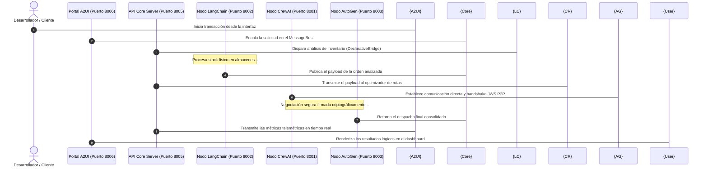

# Guía de Inicio Rápido

Esta guía le guiará a través del lanzamiento de un clúster multi-agente soberano y heterogéneo (LangChain, CrewAI, AutoGen) ejecutándose de forma asíncrona local y monitoreado mediante el Portal visual de A2UI.

---

## 1. Inicialización con la CLI Unificada

RayRabbit proporciona una CLI para iniciar el ecosistema de microservicios y la consola interactiva:

```bash
# Opción A: Inicio Integral (Lanza clúster en background y abre el chatbot interactivo)
rayrabbit start

# Opción B: Inicio por Etapas
# Terminal 1: Iniciar Hub, Servidor MCP, Servicios y Portal A2UI
rayrabbit cluster

# Terminal 2: Iniciar Chatbot Interactivo en Terminal
rayrabbit chat
```

---

## 2. Creación de un Nodo Soberano en 4 Líneas (Vía B)

Cualquier script o herramienta de dominio puede convertirse en un nodo soberano conectado al Hub mediante el cliente oficial:

```python
from rayrabbit_client import RayRabbitNode

# Conexión soberana al Hub por WebSocket
node = RayRabbitNode(agent_id="logistics_node", hub_url="ws://127.0.0.1:8005/ws")

@node.mcp_tool(category="logistics")
def get_shipment_status(order_id: str) -> dict:
    return {"order_id": order_id, "status": "IN_TRANSIT", "eta": "14:30"}

node.start()  # Instantáneamente disponible para CrewAI, LangChain y A2UI
```

---

## 3. Esquema de Puertos y Visualización A2UI

Al ejecutar `rayrabbit cluster`, los siguientes servicios quedan escuchando localmente:

1. **FastAPI Core Hub**: `http://127.0.0.1:8005` (Ingress WebSocket `/ws`, A2ARouter y MessageBus)
2. **Hub MCP Server**: `ws://127.0.0.1:8008` (Catálogo dinámico de herramientas y TaskEngine MCPv2)
3. **CrewAI Sovereign Node**: `http://127.0.0.1:8001` (`execute_crew_task`)
4. **LangChain Sovereign Node**: `http://127.0.0.1:8002` (`run_lcel_chain`)
5. **AutoGen Sovereign Node**: `http://127.0.0.1:8003` (`start_autogen_chat`)
6. **Portal Visual A2UI**: `http://127.0.0.1:8006` (Streaming reactivo y dashboard interactivo)

Abra su navegador de internet e ingrese a:
👉 **[http://127.0.0.1:8006](http://127.0.0.1:8006)** para monitorear las negociaciones entre agentes en tiempo real.

---

## Flujo Físico Local

El siguiente diagrama detalla cómo se orquestan los mensajes al lanzar el clúster por defecto en su host local:



---

!!! enterprise "RayRabbit Enterprise: Aprovisionamiento Masivo"
    En el playground local (OSS), el desarrollador inicializa los procesos manualmente y se rigen mediante un `AGENTS.md` estático.
    
    En entornos empresariales bajo **RayRabbit Enterprise**, la inicialización física está a cargo del **Hypervisor Agent** (el Kernel del Sistema Operativo de la IA). Al recibir instrucciones, el Hypervisor instancia de forma automática entornos de ejecución seguros, realiza el enrolamiento masivo de credenciales criptográficas, inyecta las capas de cumplimiento y seguridad en caliente, y establece la federación de servicios cifrada.
