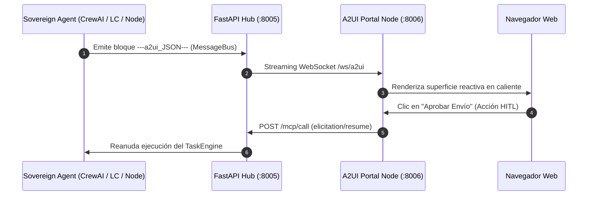

# Portal Visual A2UI & Agente Soberano (v0.9.1)

El portal interactivo de **A2UI** y el agente **`SovereignA2UIAgent`** conforman la capa de telemetría visual declarativa de RayRabbit. Operando en el **Puerto `:8006`** y consumiendo el canal de streaming `/ws/a2ui` del Hub, renderizan flujos de razonamiento, interacciones y controles de usuario en tiempo real sin requerir modificaciones en el frontend.

---

## El Agente Soberano A2UI (`SovereignA2UIAgent`)

El `SovereignA2UIAgent` es un agente de telemetría visual plug-and-play diseñado para acoplarse de forma transparente a cualquier arquitectura cognitiva:

1. **Cadenas Secuenciales (LCEL)**: Visualización paso a paso de transformaciones de datos y latencias intermedias.
2. **Cuadrillas Jerárquicas (CrewAI)**: Renderizado de la estructura de mando (Manager Agent $\rightarrow$ Worker Agents) y delegaciones.
3. **Aprobaciones Human-in-the-Loop (HITL)**: Creación dinámica de botones y formularios de aprobación que suspenden tareas mediante el `TaskEngine` hasta recibir la entrada del usuario.
4. **Ciclos Evaluador-Optimizador**: Paneles comparativos de puntuación y reintentos semánticos.
5. **Debates Multi-Agente (AutoGen)**: Visualización en tiempo real de turnos de diálogo y consensos.

---

## Primitivas del Protocolo A2UI (v0.9.1)

Los agentes de IA no generan código HTML ni React. En su lugar, emiten bloques declarativos JSON delimitados por `---a2ui_JSON---`:

```json
{
  "protocol": "a2ui/v0.9.1",
  "action": "surfaceUpdate",
  "surface_id": "logistics_monitor",
  "components": [
    {
      "type": "MetricCard",
      "props": {
        "title": "Optimización de Ruta DeepRoute",
        "value": "24h ETA",
        "status": "active",
        "badge": "DHL Express",
        "progress": 82
      }
    }
  ]
}
```

### Ciclo de Vida Visual:
* `beginRendering`: Inicializa la superficie visual en el cliente web y reserva el espacio de layout.
* `surfaceUpdate`: Aplica parches reactivos al árbol de componentes sin recargar la página.
* `updateDataModel`: Actualiza variables de estado o métricas en segundo plano.

---

## Librerías y Clientes Frontend

RayRabbit proporciona paquetes TypeScript con validación estricta mediante Zod:
* **`@rayrabbit-a2ui`**: Renderizador React/Web Component que interpreta los eventos `---a2ui_JSON---`.
* **`clients/javascript/apps/sdk-a2ui`**: Aplicación de referencia lista para producción con temas oscuro/claro y componentes glassmorphism.

---

## Topología de Streaming



---

!!! enterprise "Seguridad Enterprise y Telemetría Corporativa"
    Para entornos de producción, los canales de telemetría pueden ser completamente cifrados, controlados por acceso y auditados. RayRabbit Enterprise se integra nativamente con sistemas de Single Sign-On (SSO) corporativos (OIDC/SAML) y canaliza los flujos de eventos directamente a sistemas de cumplimiento SIEM.
