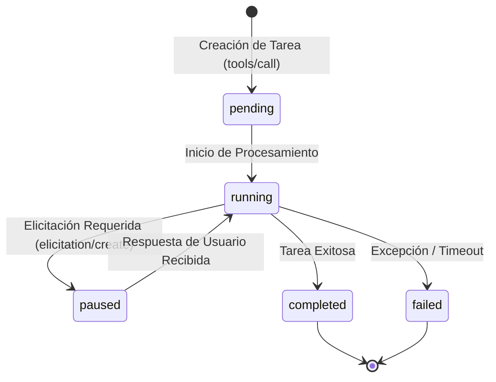

# Especificación de Model Context Protocol (MCP / MCPv2)

El protocolo **Model Context Protocol (MCP)** de Anthropic estandariza cómo los modelos de lenguaje (LLMs) y agentes descubren capacidades del entorno, intercambian contexto y ejecutan herramientas dinámicas. RayRabbit incorpora un servidor nativo MCP sobre WebSocket en el **Puerto `:8008`** y endpoints HTTP de conveniencia en el Core Hub.

---

## Servidor MCP Nativo (`ws://127.0.0.1:8008`)

El Hub Central opera un catálogo dinámico unificado en memoria con soporte completo para las primitivas de MCP:
* `tools/list`: Devuelve el catálogo consolidado de todas las herramientas provistas por nodos SDK, bridges de frameworks y conectores de bases de datos.
* `tools/call`: Despacha y ejecuta herramientas de forma asíncrona validando firmas JWS y esquemas de entrada.

---

## Desambiguación y Clasificación Dinámica por Metadatos

Para evitar el acoplamiento estático y permitir que cualquier modelo o agente consuma herramientas de forma agnóstica, toda herramienta en RayRabbit **DEBE** incluir el metadato dinámico `category` o `namespace` en su esquema JSON Schema 2020-12:

```json
{
  "name": "query_erp_inventory",
  "description": "Consulta el inventario y stock físico en tiempo real del ERP.",
  "category": "inventory",
  "inputSchema": {
    "type": "object",
    "properties": {
      "sku": {
        "type": "string",
        "description": "Código SKU del producto (ej. SKU-98124)"
      }
    },
    "required": ["sku"]
  }
}
```

### Regla Arquitectónica de Desambiguación
El catálogo MCP diferencia automáticamente dos naturalezas de herramientas:
1. **Herramientas Atómicas de Dominio (SDK)**: Scripts y consultas atómicas registradas mediante `@node.mcp_tool(category="...")` o SDKs de clientes.
2. **Herramientas de Orquestación Cognitiva**: Tareas complejas de frameworks federados (ej. `execute_crew_task`, `run_lcel_chain`).

---

## Motor de Tareas Asíncronas (TaskEngine MCPv2)

Para herramientas que requieren operaciones de larga duración o interacción humana en el bucle (*Human-in-the-Loop*), RayRabbit implementa el `TaskEngine` (`rayrabbit/core/task_engine/`):



### Características del TaskEngine:
- **Identificadores Únicos**: Cada tarea genera un `task_id` persistido transaccionalmente en SQLite.
- **Elicitación Dinámica (`elicitation/create`)**: El agente puede suspender la tarea temporalmente (`status: paused`) y solicitar datos adicionales o aprobación al usuario vía A2UI antes de continuar.
- **Streaming de Progreso**: Emite eventos telemáticos con porcentaje de avance y logs de ejecución en tiempo real.

---

## Invocación de Herramientas desde Python SDK

```python
from rayrabbit_client import RayRabbitNode

node = RayRabbitNode(agent_id="finance_service", hub_url="ws://127.0.0.1:8005/ws")

@node.mcp_tool(category="finance")
def generate_invoice(customer_id: str, amount: float) -> dict:
    """Genera una factura electrónica validada por el sistema contable."""
    return {"invoice_id": "INV-2026-001", "status": "ISSUED", "amount": amount}

node.start()
```
