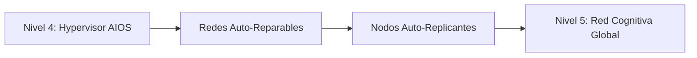

# Roadmap: Enjambres Cognitivos Nivel 5

El objetivo general de RayRabbit es sentar las bases físicas del estándar de interoperabilidad de enjambres multi-agente heterogéneos globales. El siguiente cronograma ilustra nuestros logros, planes activos y el horizonte técnico hacia redes cognitivas descentralizadas auto-reparables.

---

## Hitos del Proyecto

### Fase 1: Estabilización Core de Protocolos (Completado)
* Estandarización de mensajes **A2A** JSON-RPC.
* Servidor nativo de **Anthropic MCP** para inyecciones de contexto.
* Consola interactiva **A2UI** y telemetría declarativa interactiva local.

### Fase 2: Gobernanza Criptográfica Zero-Trust (Activo)
* Firmas criptográficas asimétricas mediante llaves robustas.
* Auditorías transaccionales encadenadas inmutables en el Core.
* Desarrollo y empaquetado del SDK **RayRabbit ARK** y adaptadores de cumplimiento.

### Fase 3: Kernel Virtualizado de IA - AIOS (Activo)
* Lanzamiento del **Agente Hypervisor Enterprise**.
* Aprovisionamiento dinámico IaC de enjambres mediante plantillas HCL estándares.
* Sandboxing y aislamiento físico de scripts de IAs en entornos seguros y runtimes aislados.

### Fase 4: Micro-Mercados Agénticos (Planificado)
* Capacidad de transacciones financieras descentralizadas entre agentes de IA.
* Compraventa dinámica de créditos de cómputo, límites de ventanas de contexto e intercambio de herramientas locales mediante micropagos.
* Auditorías distribuidas para conciliación de uso financiero corporativo entre organizaciones.

---

## Nivel 5: Redes Agénticas Cognitivas y Auto-Evolutivas

La cúspide en nuestra taxonomía de evolución agéntica se consolida en el **Nivel 5: Enjambres Cognitivos Auto-Evolutivos**.

Al alcanzar el Nivel 5, el ecosistema de inteligencia artificial deja de comportarse como una grilla de servidores estáticos configurada por programadores. Pasa a estructurarse como una **red automórfica viva**:
1. **Topologías Auto-Reparables**: Si un nodo de agente experimenta caídas de red o fallos críticos continuos de LLM, el Hypervisor destruye el contenedor e instancia de forma autónoma una réplica idéntica, transfiere sus claves de seguridad y restablece las colas de mensajes del MessageBus en caliente sin intervención de desarrolladores.
2. **Selección Dinámica de Herramientas**: Las IAs evalúan el desempeño de los servicios analizando los logs de A2UI. Si detectan que un agente proveedor de meteorología es demasiado lento o costoso, el agente rescinde el contrato y establece de forma autónoma un acuerdo de mTLS con un proveedor alternativo en el mercado abierto para resolver su tarea.
3. **Federaciones Cognitivas Edge**: El enjambre distribuye su procesamiento de forma inteligente e internacional a través de dispositivos en el borde y nubes híbridas en caliente, optimizando latencias, costes de cómputo GPU y cumplimiento de soberanía de datos locales al instante.
