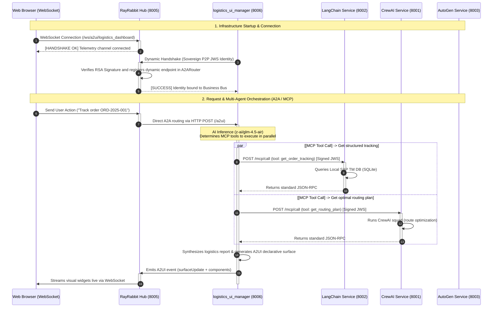
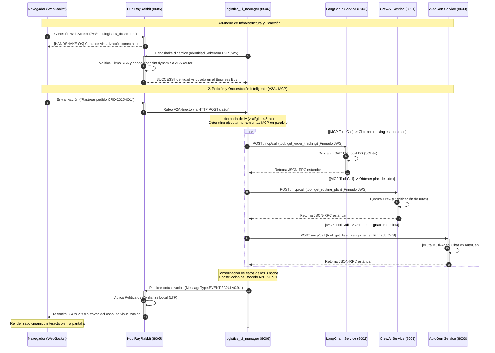
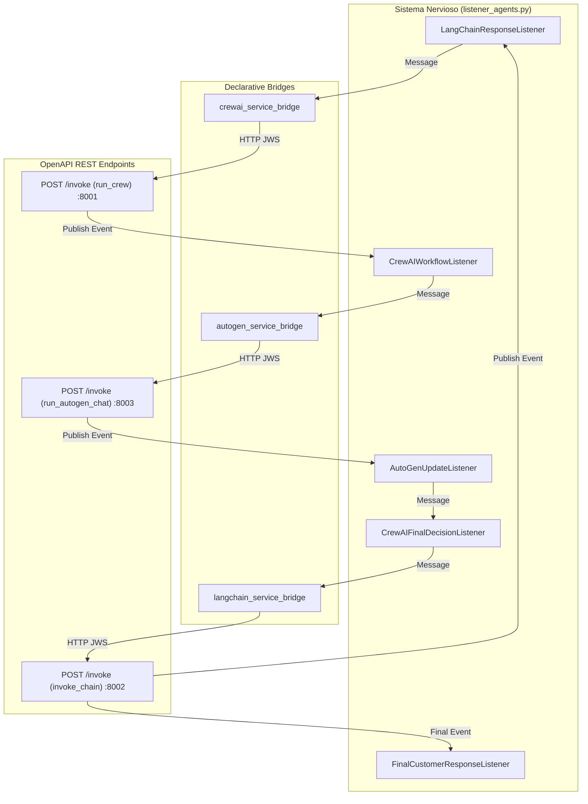

# Logistics Use Case — RayRabbit (Dual-Mode: Sovereign A2A/MCP & OpenAPI Declarative Bridge)

## Purpose and Vision

This enterprise reference use case demonstrates **real, decentralized, and framework-agnostic interoperability** with RayRabbit mediating between heterogeneous cognitive agents (**LangChain**, **CrewAI**, **AutoGen**).

The infrastructure natively and interchangeably supports **two operation modes**:

1. **Sovereign Native Mode (`communication_mode: 'p2p'`)**: Based purely on open standards (**Google A2A JSON-RPC 2.0**, **Anthropic MCP v2**), cryptographic perimeter security (**MAESTRO Framework with Mutual PoP RSA-4096**), and reactive UI streaming (**A2UI Standard v0.9.1**).
2. **Declarative Bridge Mode (`communication_mode: 'bridge'`)**: Based on Zero-Code OpenAPI contracts (`/openapi.json` and `/invoke`) and a dynamic listener network over the MessageBus.

---

## 1. Native P2P Interoperability Architecture (A2A + MCP)

In this mode, each microservice operates as a sovereign node (*Shared Nothing*), dynamically resolving tools via MCP and orchestrating tasks via JSON-RPC 2.0:



---

## 2. Quick Execution Guide

### Prerequisites
* 4 open terminal windows (or run `python run_local_rayrabbit_cluster.py` to launch all automatically).
* Hub running on Port 8005.

### Step 1: Start Hub Core
```bash
python -m uvicorn api.server:app --host 127.0.0.1 --port 8005
```

### Step 2: Start Cognitive Framework Services
```bash
# Terminal 2: CrewAI Service (Port 8001)
python -m examples.services.crewai.crewai_service

# Terminal 3: LangChain Service (Port 8002)
python -m examples.services.langchain.langchain_service

# Terminal 4: AutoGen Service (Port 8003)
python -m examples.services.autogen.autogen_service
```

### Step 3: Start Sovereign A2UI Portal (Port 8006)
```bash
python rayrabbit/examples/logistics_use_case/run_logistics_agent.py
```

Open `http://localhost:8005/dashboard` in your web browser to observe real-time inter-agent communication, telemetry, and live interactive UI surfaces!

---

<details>
<summary>🇪🇸 Documentación Completa en Español (Haz clic para desplegar)</summary>

# Caso de Uso de Logística — RayRabbit (Dual-Mode: A2A/MCP Soberano & OpenAPI Declarative Bridge)

## Propósito y Visión

Este caso de uso demuestra la **interoperabilidad real**, agnóstica y descentralizada de RayRabbit mediando entre agentes y servicios de frameworks cognitivos heterogéneos (**LangChain**, **CrewAI**, **AutoGen**). 

La infraestructura soporta de forma nativa e intercambiable **los dos modos de operación**:

1. **Modo Soberano Nativo (`communication_mode: 'p2p'`)**: Basado exclusivamente en estándares abiertos (**Google A2A JSON-RPC 2.0**, **Anthropic MCP v2**), seguridad perimetral de firmas (**Marco MAESTRO con Mutual PoP RSA-4096**) y visualización reactiva (**Estándar A2UI v0.9.1**).
2. **Modo Declarativo Bridge (`communication_mode: 'bridge'`)**: Basado en integración Zero-Code mediante contratos **OpenAPI 3.0/3.1** (`/openapi.json` e `/invoke`) y un sistema nervioso de agentes listeners sobre el MessageBus.

---

## 1. Arquitectura de Interoperabilidad Nativa P2P (A2A + MCP)

En este modo, cada microservicio opera como un nodo soberano (*Shared Nothing*), resolviendo herramientas dinámicamente vía MCP y orquestando tareas mediante JSON-RPC 2.0:



---

## 2. Arquitectura Declarativa Bridge (OpenAPI + Listeners)

En este modo (`communication_mode: 'bridge'`), el Hub auto-descubre los contratos OpenAPI (`/openapi.json`) de los servicios externos y los expone al MessageBus mediante `DeclarativeBridge`. Los agentes listeners coordinan la cascada reactiva:



---

## Guía de Lanzamiento y Ejecución

La suite logística soberana se administra y ejecuta de forma unificada utilizando el lanzador dinámico y cross-platform del clúster.

### Modo 1: Ejecución en Clúster Unificado P2P (Recomendado)

#### Paso 1: Iniciar el Clúster Soberano (1 sola ventana)
Abre tu consola en la raíz del repositorio y ejecuta:
```bash
python run_local_rayrabbit_cluster.py
```
*Este comando se encarga de forma automática de:*
1. Limpiar sockets y puertos huérfanos del clúster anterior (evitando errores `10048` de bindeo).
2. Levantar secuencialmente el Hub Core en el puerto `8005`.
3. Detectar dinámicamente y arrancar los servicios soberanos externos (`crewai_service` en `8001`, `langchain_service` en `8002`, `autogen_service` en `8003`) en sus respectivos entornos virtuales (`venv`).
4. Levantar la capa de visualización e interacción: `A2UI` (puerto `8006`), nodos de dominio y consola limpia.

#### Paso 2: Abrir el Dashboard de Visualización
Navega en tu navegador a la URL nativa servida por el Hub:
```
http://127.0.0.1:8005/dashboard/index.html
```

#### Paso 3: Validación E2E Automatizada (AAIF)
Para ejecutar la suite completa de pruebas de interoperabilidad de extremo a extremo en modo P2P:
```bash
python rayrabbit/examples/logistics_use_case/run_logistics_aaif.py "Rastrear pedido ORD-2025-001"
```

---

### Modo 2: Ejecución en Modo Declarativo Bridge (OpenAPI)

Para operar en la Vía A (Zero-Code OpenAPI):
1. Configura en `config.yaml`:
   ```yaml
   custom:
     discovery:
       communication_mode: 'bridge'
   ```
2. Inicia los listeners del sistema nervioso:
   ```bash
   python rayrabbit/examples/logistics_use_case/run_listeners.py
   ```
3. Ejecuta el proyecto logístico clásico:
   ```bash
   python -c "import asyncio; from rayrabbit.examples.logistics_use_case.project import LogisticsClassicProject; asyncio.run(LogisticsClassicProject('logistics').execute({'order_info': 'Mi paquete #A123 no llegó'}))"
   ```

---

## Auditoría Criptográfica y Trazabilidad perimetral

RayRabbit implementa el marco **MAESTRO** perimetral para asegurar cada interacción en el bus:
- Cada mensaje que viaja entre los agentes soberanos requiere autenticación criptográfica robusta vía **JWS (JSON Web Signature)** compacta (RFC 7515).
- Las claves públicas se intercambian dinámicamente en el arranque mediante el handshake de firma RSA en el endpoint `/api/security/register`.
- Cada llamada es inmutablemente registrada en la base de datos cifrada SQLite correspondiente (`audit_logs/agent_{agent_id}_audit.db`).

Para consultar el estado de auditoría del clúster y el contenido de transacciones perimetrales, ejecuta:
```bash
python query_audit.py --limit 20
```

---

## Principios Arquitectónicos Demostrados

1. **Desacoplamiento Absoluto (Shared-Nothing)**: El core de RayRabbit no importa librerías nativas de terceros. Los agentes externos mantienen 100% de soberanía sobre su pila tecnológica y almacenamiento SQLite local.
2. **Paridad Dual Transparente**: Soporte simétrico para servicios OpenAPI REST (Vía A) y Nodos Nativos A2A/MCP (Vía C) sin fricción de código.
3. **Resiliencia con Offline Tolerance**: Si un servicio de red está temporalmente ocupado o reiniciándose, el Hub retiene las transacciones en la outbox de SQLite de forma segura, previniendo pérdidas de paquetes.

</details>
